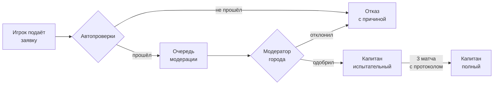
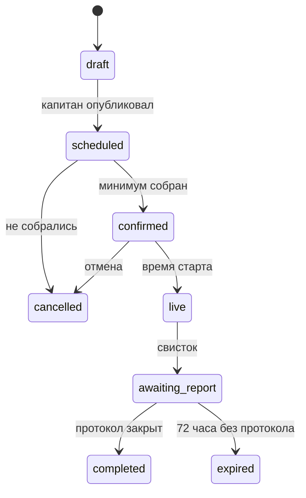
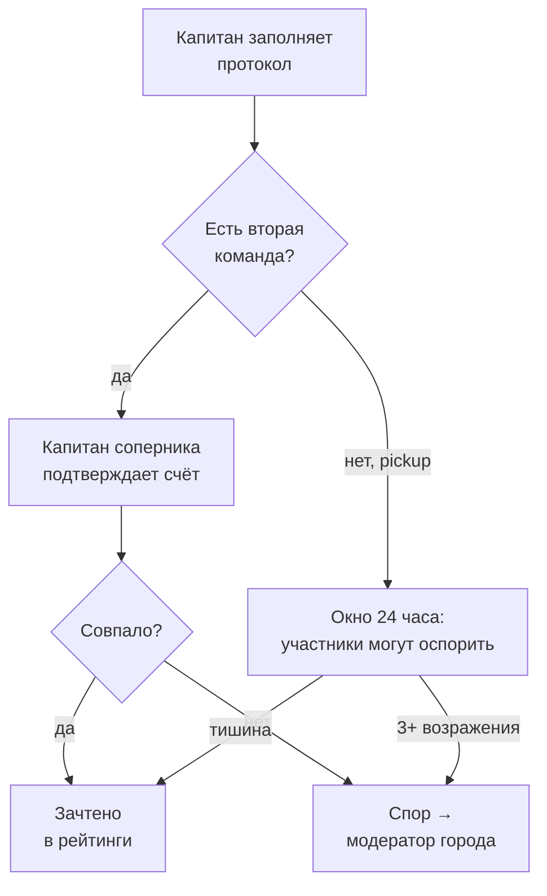
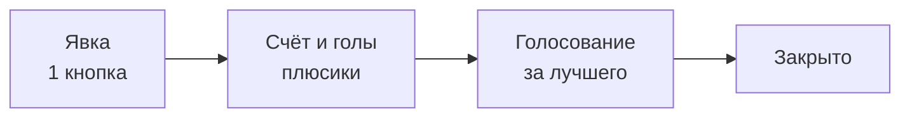
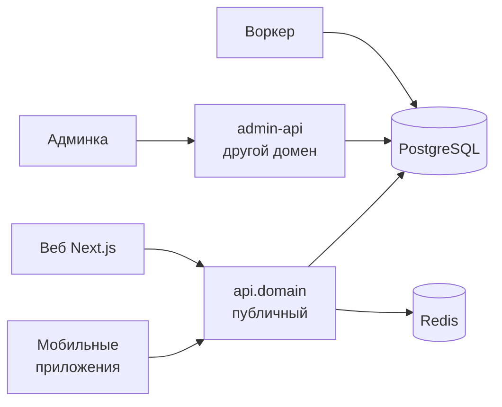
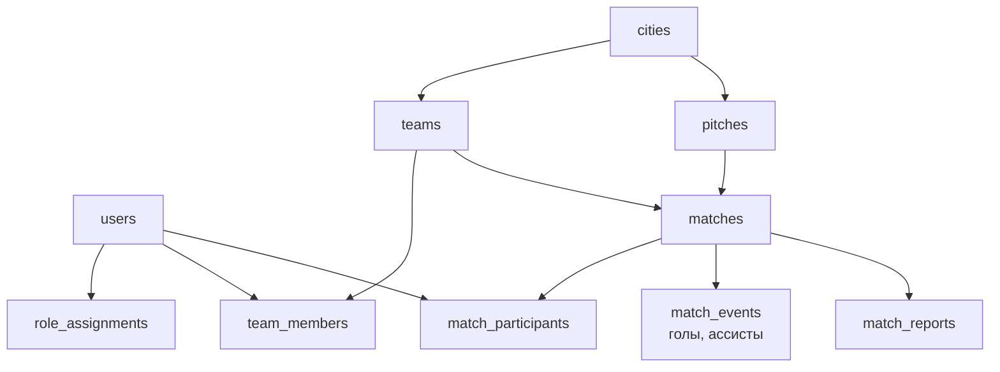

# Футбольная платформа: рынок, продукт, архитектура

2026-09-21 · @Alex

## Резюме

Строим приложение, где дворовой футболист находит игру своего уровня в своём городе, а капитан собирает команду и матч за три тапа. Веб + iOS + Android, Go на бэкенде, мультистрана с первого дня.

Главное отличие от того, что уже есть на рынке: **капитан как верифицированная роль**. Все умершие аналоги позволяли создавать команды и игры кому угодно — и тонули в пустых командах, неявках и мусорных данных. Мы вводим отбор на входе в роль капитана и вешаем на него ответственность за состав, поле и деньги. Это даёт доверие к данным, а доверие к данным — единственное, на чём можно потом построить статистику, рейтинги и турниры.

Честная оценка рынка: чистых D2C-приложений «найди футбол» похоронено больше десятка (раздел «Анализ рынка»). Выживают те, кто держит либо плотность в одном городе, либо деньги внутри продукта. Поэтому стратегия такая: **сначала один город до 150–200 матчей в неделю, потом клонирование городов, и только потом — платёжный слой**, который и есть настоящий бизнес.

MVP: один город, ручное подтверждение капитанов, ручное добавление полей, бесплатно для всех. Подписка включается не раньше, чем в городе появится больше матчей, чем один человек успевает просмотреть.

## Анализ рынка: глобальные игроки

Рынок распадается на пять разных бизнесов, которые постоянно путают: оператор игр (сам арендует поле и продаёт слоты), маркетплейс открытых игр, SaaS для команд, букинг площадок и корпоративный абонемент. Наша идея — гибрид второго и третьего, причём третий (команда как единица) почти никто не соединил со вторым.

| Продукт | Рынок, масштаб | Кто создаёт игру | Монетизация | Что у них работает / болит |
| --- | --- | --- | --- | --- |
| [Footy Addicts](https://footyaddicts.com/) | UK, 40+ городов, 269 000+ регистраций, \~34 000 активных/мес | Хост после порога \~20 сыгранных игр, компенсация — играет бесплатно | £5–£10 за игру, процент не раскрыт, пакеты со скидкой | Порог на хоста работает. Болит: токсичные игроки, дропауты, аренда +55% за 4 года |
| [Plei](https://www.plei.com/) | США/Канада, 27–38 регионов, 600 000 игроков (заявление компании) | Только сам Plei — пользователь НЕ может создать игру | $5–$12 за игру, подписки нет | Лучшая на рынке политика отмен (см. ниже). Болит: нельзя хостить, несовпадение уровней |
| [GoodRec](https://www.goodrec.com/) | США/Канада/EU, 68 городов, 1 млн игроков, 65 000 игр за 2025 | GoodRec + верифицированные хосты (бейджи) | \~$10+ за игру, подписки нет, бутстрап на предоплате | QR-чекин, MVP матча. Болит: нет штрафов за неявку, перепродажа слотов |
| [Spond](https://www.spond.com/) | 19–100+ стран, **4 млн MAU**, оборот платежей €160 млн/год | Команда/клуб | Ядро бесплатно навсегда; деньги — 2,5% + фикс с платежей | Главный урок рынка: бесплатный продукт, заработок на платёжном рельсе |
| [Fubles](https://www.fubles.com/en/) | Италия, с 2007, 1,17 млн игроков, 505 000 матчей | Любой организатор | Не раскрыта | **Лучшая репутационная система**: рейтинг 0–100, автоматическая метка «ненадёжный», чёрные списки |
| [OpenSports](https://opensports.ca/pricing) | 40+ стран, B2B2C | Организатор | От **$750/мес** + 3% с транзакций | Самый прозрачный прайс на рынке |
| [Playo](https://playo.co/) | Индия + ОАЭ/Катар, 5 млн+, 1M+ установок, 4,8★ | Игрок создаёт активность | Комиссия с брони + SaaS площадкам | Эталон «найти игроков + забронировать поле», но трафик падает |
| [Pickup](https://www.pickupgames.app/) | 8 стран, \~80 городов, 25 000 игроков | Любой | Полностью бесплатно | Учебный провал: 80 городов и **50 игр в неделю** — ликвидности нет |

### Три вещи, которые нужно списать у них целиком

1. **Политика отмен Plei.** Матч подтверждается минимум за 5 часов до старта. Отмена больше чем за 5 ч — возврат; 3–5 ч — только если нашёл замену; меньше 3 ч — без возврата. Неявка — списание + штраф $5 + бан на бесплатные игры.
2. **Репутация Fubles.** Игрок помечается ненадёжным автоматически: неподтверждённый телефон, неявки в последних 20 играх, опоздания в последних 10, запись на две игры в одно время. Это то, что у тебя должно быть с первой версии.
3. **Бесплатное ядро Spond.** 4 млн MAU без подписки на ядро, деньги — с оборота.

### Сколько людей вообще играют

США: 16,8 млн взрослых играют в футбол на улице (2025), около 90% участия — малые форматы. Англия: \~1,5 млн взрослых играют еженедельно, и только \~16% — в соревновательных лигах. Главная цифра всего рынка — [73% американцев играли в детском спорте, и только 25% продолжают взрослыми](https://www.benzinga.com/partner/general/26/04/52088995/how-goodrec-ceo-lewis-black-built-a-sports-platform-reshaping-americas-30-billion-recreation-indu). Этот разрыв и есть твой рынок.

## Анализ рынка: Россия, СНГ и соседи

В России нет ни одного живого D2C-приложения для сбора на футбол. Это и возможность, и предупреждение: пять попыток уже умерли.

Футболом в РФ занимаются [3,34 млн человек](https://www.sports.ru/football/1115048431-futbol-samyj-massovyj-vid-sporta-v-rossii-po-dannym-minsporta-im-zanim.html) — вид спорта №1. По [исследованию РФС и Mediascope](https://www.rfs.ru/news/221942) (ноябрь 2024, города 100k+): 10% играют еженедельно, среди мужчин 12–34 лет — 27%.

| Сервис | Что делает | Состояние |
| --- | --- | --- |
| [FindSport](https://findsport.ru/football) | Агрегатор площадок, 21 город, 67 манежей в Москве. Заявляет, что комиссий не берёт | Жив 13 лет, но у мобильного приложения даже нет рейтинга — мало оценок. Живёт на SEO |
| [Games by FindSport](https://games.findsport.ru/) | Создать игру → ссылка → запись в один тап, статус «кто оплатил» | Ближайший конкурент по смыслу. Бесплатен, платёж не проводит, нет команд и статистики |
| [TeamTeam](https://teamteam.football/) | Маркетплейс игр с оплатой при записи, боты в TG/WA | Жив, но **5+ установок** в Google Play — фактически ноль |
| [TeamList](https://teamlist.ru/moskva/football/) | Разовая запись на тренировки, уровень 1–5, 0–900 ₽ за занятие. Москва, Алматы, Семей | Жив, но без мобильного приложения |
| [Join.Football](https://go.join.football/football-platform) | Конструктор сайтов лиг: таблицы, протоколы, статистика, приложения | Жив. Тариф «Любительская лига» — 490 ₽/мес. Продаёт хостинг, не транзакции |
| SportGate, Play in Team, Overmatch, Сетка | Букинг и социальные слои | **Все мёртвы.** Последние обновления 2018–2023 |
| [«В состав!»](https://sport.onliner.by/2026/07/24/v-belarusi-zapustili-telegram-bot-dlya-poiska-igrokov-i-komand-v-lyubitelskom-futbole) (Беларусь) | TG-бот «ищу команду / ищу игрока» | Запущен июль 2026 — доказательство, что базовая потребность до сих пор не закрыта |
| [FTogether](https://bluescreen.kz/ftogether-poisk-futbolnogho-matcha-v-odnom-prilozhienii/) (Казахстан) | Гео-поиск игр, рейтинги организаторов, комиссия с игры | MVP-стадия, 2026 |

### Соседи, у которых стоит учиться

**[Rakipbul](https://www.rakipbul.com/) (Турция)** — 16 городов, 140 полей, 25 000+ команд, 200 000+ игроков. Лига + букинг + медиа как один продукт, спонсоры Nike и Tivibu. При этом турецкие приложения-агрегаторы (Halısahavar и др.) мертвы. Вывод: выиграл тот, кто владеет форматом соревнования, а не списком полей.

**[CeleBreak](https://celebreak.com/)** — 9 городов включая Дубай и Берлин, €1,1 млн раунд. На каждой игре есть Match Host — оплачиваемый человек с мячом и манишками.

**[JoGo.Team](https://jogo.team/dubai/)** — Дубай и США, 27 полей в Дубае, AED 35–50 за игрока, собственный JoGo Wallet с предоплатой.

### Цены аренды — цифры, на которых строится вся экономика матча

Москва: 2 000–12 000 ₽/час. СПб: 1 500–7 200 ₽/час. Казань: от 1 500 ₽. Алматы: 6 000–20 000 ₸. При делении на 12–14 человек это 150–900 ₽ с человека — именно та сумма, которую сегодня капитан собирает переводами вручную.

Важная деталь: прямые операторы (PlayPark, РЖД Арена, FFC) цены **не публикуют** — только звонок или форма. Поэтому автоматическая интеграция с бронированием полей невозможна на MVP ни технически, ни бизнес-смыслово — твоё решение добавлять поля вручную верное.

## Выводы: где дыра и чем мы отличаемся

Рынок разрезан на слои, и никто не сшил их вместе.

| Слой | Кто закрыл | Кто не закрыл |
| --- | --- | --- |
| Найти поле и увидеть цену | FindSport | — |
| Собрать состав | никто | Telegram-чат, плюсики, «лишний Гоша» |
| Собрать деньги | никто | Перевод на карту организатора |
| Команда как постоянная единица с историей | почти никто | Лиговой софт за 490 ₽/мес для организаторов, не для дворовой команды |
| Статистика игрока, которой можно верить | только Fubles, частично | — |

### Наша позиция одним предложением

Не «ещё одно приложение найти игру», а **инфраструктура любительской команды**: капитан, состав, расписание, деньги, статистика и соревнование в одном месте. Pickup-игры — входная воронка, а не продукт.

### Четыре вещи, которые дают нам преимущество

1. **Капитан как верифицированная роль.** У Footy Addicts порог в 20 игр, у GoodRec — бейджи, но ни у кого капитан не является ядром модели данных. У нас без капитана нет ни команды, ни матча, ни гола. Это убивает спам и делает статистику осмысленной.
2. **Команда, а не толпа.** Все лидеры США продают разовый слот незнакомцу. Удержание там строится на привычке к приложению. У нас оно строится на привязанности к команде — это на порядок сильнее.
3. **Соревновательная оболочка.** Rakipbul выиграл Турцию тем, что дал любителям лигу, а не список полей. Статистика, бомбардиры, таблицы города — это не геймификация ради геймификации, это причина возвращаться.
4. **Мультистрана в архитектуре, но не в запуске.** Грузия, Сербия, часть Балкан — белые пятна без единого игрока. Строим всё многоязычным и многовалютным с первой строки кода, но запускаем в одном городе.

### Главный риск, который надо принять сразу

Футбол — худший вид спорта для матчмейкинга: нужно 10–22 человека одновременно в одной точке. Именно поэтому капитал ушёл в падел (4 человека): Fubles проигрывает Playtomic, Anybuddy ушёл в ракетки, Hudle — в пиклбол, британский Powerleague строит 76 падел-кортов вместо футбольных полей.

Наш ответ на это: **мы не собираем 14 незнакомцев с нуля каждый раз**. Мы собираем команду один раз и потом подтягиваем 2–4 человек на каждый матч. Это задача уровня падела, а не футбола.

## Роли и верификация капитанов

Роль — это не галочка в профиле, а набор прав в конкретном контексте (глобально / город / команда / матч). Это важно заложить сразу — переделывать потом дорого.

| Роль | Область | Может |
| --- | --- | --- |
| Гость | — | Смотреть витрину города, 1 матч в деталях, не может подать заявку |
| Игрок | Аккаунт | Профиль, заявки в команды, участие в матчах, статистика |
| **Капитан** | Одна команда | Создать команду, матчи, состав, вести протокол, добавлять поля |
| Вице-капитан | Одна команда | Всё, кроме роспуска команды и смены капитана |
| Модератор города | Город | Подтверждать капитанов и поля, разбирать жалобы |
| Админ | Глобально | Всё + биллинг, фича-флаги, доступы |

В базе это одна таблица `role_assignments (user_id, role, scope_type, scope_id)`, а не поле `role` в `users`. Иначе при первой же задаче «человек капитан в одной команде и обычный игрок в другой» всё развалится.

### Как становятся капитаном



Автопроверки на MVP: подтверждённый телефон, возраст 14+, заполненный профиль, нет активных банов, не капитан другой команды в этом городе. В форме заявки — город, предполагаемое поле, формат (5×5, 6×6, 8×8, 11×11), частота игр, ссылка на чат или соцсеть. Модератор видит это одним экраном и жмёт одну кнопку.

### Почему испытательный статус

Капитан-испытательный ведёт команду полноценно, но его протоколы не идут в городские рейтинги и таблицы бомбардиров. Так ты пускаешь людей в продукт быстро, но не пускаешь мусор в публичные цифры.

### Смена и потеря капитана — самый часто забываемый случай

Капитан удалил аккаунт, забросил команду, получил бан — команда из 10 человек не должна умирать. Правила:

- Капитан может передать роль любому игроку команды — тот подтверждает.
- Без активности капитана 60 дней вице-капитан может запросить передачу через модератора.
- Бан капитана не удаляет команду и не стирает сыгранные матчи; команда встаёт на паузу до нового капитана.

### Капитан меняет город

Правило «один капитан — одна команда» действует в пределах города, поэтому при смене города в профиле система останавливает человека и спрашивает прямо: «Вы капитан «Быков» в Ставрополе. Остаётесь капитаном или передаёте команду?»

Три варианта ответа: остаться капитаном удалённо (можно — люди ездят и возвращаются), передать роль вице-капитану, или поставить команду на паузу. Заявка на капитанство в новом городе блокируется, пока этот вопрос не закрыт.

### Кто назначает вице-капитана

Только капитан, и только из активного состава. Модератор города не может назначить вице-капитана сам — он участвует только в сценарии «капитан пропал на 60 дней», и только по запросу самой команды. Один вице-капитан на команду.

## Команды

Один капитан — одна команда в пределах одного города. Глобально запрещать вторую команду не надо: человек может переехать. думаю тут просто после смены города должна быть проверка что вот вы капитан там то, подтвердите что вы им являетесь или смените команду что-то такое&#32;

### Нейминг

Капитан вводит «Быки» → система хранит три поля:

| Поле | Значение | Уникальность |
| --- | --- | --- |
| `name` | Быки | нет |
| `display_name` | Быки Вашингтон | нет (генерится) |
| `slug` | `us-washington-byki` | **глобально уникален** |

Уникальный индекс ставится на пару `(city_id, normalized_name)`, где `normalized_name` — нижний регистр без пробелов и диакритики. Иначе получишь «Быки», «БЫКИ» и «Быки » в одном городе. Отдельно нужен фильтр на гомоглифы — латинская `a` вместо кириллической в названии команды и нике — иначе клоны пройдут все проверки.

Переименование — не чаще раза в 90 дней, с сохранением старого slug на редирект. Иначе команды будут менять имя после каждого проигрыша и вся история потеряет смысл.

### Состав

Капитан задаёт лимит состава при создании, но не любой: система считает его от формата. Для 5×5 — от 5 до 12, для 8×8 — от 8 до 18, для 11×11 — от 11 до 25. Верхняя граница убивает команды-свалки на 100 человек, нижняя — команды на двоих ради красивого названия.

Статусы участника: `pending` → `active` → `left` / `removed`. История членства не удаляется никогда — иначе статистика «за какие команды я играл» развалится.

Игрок может состоять в нескольких командах — в реальности люди играют и с работой, и с двором. Но на один матч он может быть заявлен только за одну команду, и система предупреждает о пересечении по времени с другим матчем.

### Возрастные ограничения команды и матча

Идея рабочая и закрывает сразу две задачи: школьники не попадают в состав к взрослым мужикам, а ветеранские составы 35+ не собирают случайных студентов.

Капитан задаёт у команды `min_age` и `max_age` — оба необязательны. У матча свои поля: по умолчанию наследуются от команды, но могут быть смягчены или ужесточены под конкретную игру. В интерфейсе — готовые пресеты: без ограничений, 14–17, 18+, 30+, 35+, 45+.

Шесть правил, без которых это сломается:

1. **Проверка по возрасту на дату матча**, а не на дату заявки. Иначе человек «взрослеет» посреди турнира и логика рассыпается.
2. **Не прячь матч целиком.** Игрок видит его в ленте, но кнопка заявки заблокирована с понятной причиной («Матч для игроков 35+»). Скроешь — человек решит, что в городе пусто.
3. **Действующий состав не выкидывается** при изменении порога. Капитан получает список тех, кто перестал подходить, и решает сам.
4. **Порог ниже минимального возраста страны недоступен** — берётся из `min_signup_age` страны города.
5. **Возраст остаётся скрытым.** Капитану показывается только «подходит / не подходит», а не дата рождения чужого человека.
6. **Смешанный состав** — если в матче есть несовершеннолетние, капитан видит подсказку об ответственности. Именно подсказку, а не блокировку — во дворе это норма.

Возрастной диапазон становится и фильтром в ленте города — это сразу даёт два естественных сегмента: школьный футбол после уроков и ветеранский по выходным.

### Вторая команда капитана — нет, но

Ты спрашивал, может ли капитан делать две команды, чтобы собрать матч. Это не надо решать через вторую команду — это решается **открытым матчем без второй команды** (см. раздел «Матчи»): капитан создаёт матч на 20 слотов, свои 10 занимает команда, остальные открываются городу. Делать фиктивную вторую команду — значит самому сломать статистику, ради которой всё строится.

## Поля и слоты

На MVP поля добавляют капитаны вручную, модератор города подтверждает. Интеграция с букингом полей невозможна: большинство российских объектов не публикуют даже цены, не то что API.

### Поле в базе

Поле: название, адрес, координаты (lat/lon), город, покрытие (искусственный газон / земля / паркет / асфальт), тип (открытое / крытый манеж), размер и форматы, освещение, раздевалки, платное/бесплатное, типовая цена за час, телефон администратора, фото, кто добавил, статус модерации.

Бесплатные коробки во дворах — отдельный тип поля с пометкой «без брони». Для них контроль слотов работает как предупреждение, а не как запрет — на дворовой коробке две компании реально могут договориться на месте.\
\
так же все поля должны пока нет карт вручную админом проверяться и подтверждаться&#32;

### Дубли

Ручной ввод гарантированно даст три записи на одно поле. При создании показывай существующие поля в радиусе 150 м и спрашивай «это одно из них?». В админке — очередь похожих полей и кнопка «слить», которая перевешивает все матчи на основное.

### Запрет двойного бронирования

Это тот случай, где проверка в коде недостаточна: два капитана могут нажать «Создать» в одну миллисекунду. Защита должна быть в PostgreSQL:

```
ALTER TABLE matches ADD COLUMN slot tstzrange
  GENERATED ALWAYS AS (tstzrange(starts_at, ends_at, '[)')) STORED;

CREATE EXTENSION IF NOT EXISTS btree_gist;

ALTER TABLE matches ADD CONSTRAINT no_overlap_on_pitch
  EXCLUDE USING gist (pitch_id WITH =, slot WITH &&)
  WHERE (status IN ('scheduled','confirmed') AND pitch_bookable = true);
```

Одна строка в схеме закрывает весь класс багов, который иначе будешь ловить годами. Отменённые матчи выпадают из ограничения автоматически.

Добавь технический зазор: матч на 2 часа блокирует слот + 10 минут после, чтобы люди успели разойтись.

### Геоиерархия

Страна → регион → город → район. Города — справочник с собственными id, а не строка в профиле. Базу городов берём из GeoNames (открытая лицензия CC BY) и включаем только города, где есть хотя бы один подтверждённый капитан — иначе пользователь выберет город и увидит пустоту.

## Матчи и тренировки

У матча есть тип, и это главное решение в продукте. Три типа покрывают всё, что ты описал.

| Тип | Суть | Идёт в статистику |
| --- | --- | --- |
| `friendly` | Две команды друг против друга | Да: счёт, голы, ассисты, рейтинги |
| `pickup` | Один капитан собирает N слотов, делит на две стороны на месте | Частично: участие да, голы да, командный результат нет |
| `training` | Тренировка своей команды | Только посещаемость |

`pickup` решает твой вопрос про вторую команду без фейковых команд.\
\
тут же надо добавиь турнир, где будут добавлять команды и турнирная таблица, сетка и т д&#32;

### Жизненный цикл матча



`expired` обязателен. Без него у тебя через полгода будет тысяча «идущих» матчей, которые засорят все экраны.

### Закрытый / открытый

Не галочка, а три уровня видимости: `team_only` (только свои), `invite_only` (виден в городе, но вход по одобрению капитана), `public` (занимай слот сам). Средний — самый востребованный в реальной жизни.

### Позиции и сменный вратарь

У каждого слота в матче есть позиция: GK, DEF, MID, FWD или ANY. Капитан задаёт раскладку при создании.

Режим сменного вратаря — хорошая идея, которой ни у кого нет. Работает так: капитан включает флаг и ставит длину отрезка (например, 10 минут или по кол-ву голов). Приложение генерит очерёдность из всех полевых игроков, показывает её на экране матча и даёт таймер с звуком: «Сейчас в воротах Миша, следующий — Серёга». Минуты на воротах попадают в статистику — это маленькая, но очень узнаваемая деталь для тех, кто играет во дворе.

### Как найти соперника

Капитан создаёт **вызов** — отдельная сущность: поле или район, дата или окно дат, формат, стоимость пополам, уровень. Другие капитаны города видят ленту вызовов и отвечают. Первый принятый ответ превращает вызов в матч и блокирует слот поля.

Вызовы — самый сильный движок ликвидности в продукте: один капитан своим действием поднимает 20 человек, а не одного.\
\
должны быть пуши, например если игрок в городе И и кто-то создал там команду/матч ему приходит что-то типа в вашем городе была создана .....

## Деньги за аренду: мы их не трогаем

**Платформа никогда не принимает, не хранит и не переводит деньги за аренду.** Это не этап MVP, а постоянное архитектурное решение. Мы только считаем и показываем, кто сколько должен взять с собой. Расчёт между игроками и капитаном идёт наличными или их собственными переводами, мимо нас.

Это снимает целый класс проблем: не нужны эквайринг, касса, возвраты, споры, лицензии на переводы и разбор налогового режима в каждой новой стране. Мультистрана при таком подходе становится реальной, а не многолетним проектом по получению разрешений.

### Как считается

Капитан вводит цену за час и длительность — всё остальное делает приложение.

| Шаг | Пример |
| --- | --- |
| Цена за час | 3 000 ₽ |
| Длительность | 2 часа |
| Итого за поле | 6 000 ₽ |
| Делится на | всех подтверждённых участников **обеих команд** |
| При 20 игроках | 300 ₽ с человека |
| При 16 игроках | 375 ₽ с человека |

Игрок видит одну строку на карточке матча и в напоминании за 2 часа: «Возьми 300 ₽, отдать — Алексею». Кто получатель — отдельное поле матча: часто за поле платит не капитан, а тот, кто приехал раньше.

### Три детали, которые легко пропустить

1. **Считаем по факту, а не по плану.** Сумма пересчитывается при каждом изменении состава. Показывай вилку: «сейчас 375 ₽, при полном составе — 300 ₽». Это самая дешёвая мотивация звать людей, которая у тебя есть.
2. **Капитан ведёт реестр галочками** «отдал / не отдал». Это не платёж, а заметка — юридически то же самое, что блокнот. тут можно помечать кстати игроков которые например не платят, капитан можт ставить профилю статус не заплатил, чтоб другие команды и игроки видели это и может так же снимать таукю галочку. но нужно злоупотребление этим тоже как-то учесть&#32;
3. **Долг виден только капитану и самому игроку.** Публичный список должников — токсично и развалит команды. а вот тут я выше описал, давай тогда если у одного игрока несколько таких не оплат появляется от одного или разных источников то тогда его эта особенность становистя публичной и какой-то бейдж типа не платежный игрок

### Метка неплательщика

Самая опасная механика в документе, поэтому правила жёсткие. Одна метка от обиженного капитана не должна ломать человеку репутацию в городе.

| Событие | Что видно |
| --- | --- |
| Первая неоплата | Только капитану и самому игроку. Забыл или не было с собой — нормальная ситуация |
| Вторая от того же капитана | По-прежнему приватно |
| **Две от разных капитанов из разных команд** | Метка становится публичной — бейдж виден капитанам при рассмотрении заявки |
| Следующая оплата подтверждена | Метка снимается автоматически |
| 90 дней без новых меток | Сгорает сама |

Защита от злоупотребления — четыре механизма. Метки от одного капитана никогда не суммируются в публичный статус, сколько бы их ни было. Игрок видит каждую метку сразу и может оспорить через модератора. Капитан, у которого доля меток аномально высокая, сам попадает в очередь модерации. И поставить метку можно только на матче с подтверждённой явкой этого игрока и с указанной суммой аренды — на бесплатном матче кнопки просто нет.

Формулировка бейджа важна: не «Должник» и не «Не платит», а нейтральное «Спорные расчёты» с числом случаев. Суммы не показываем никому — мы не сторона расчётов и не подтверждаем факт долга, а только показываем, что несколько капитанов отметили проблему.

Бесплатный матч — флаг `is_free`, и весь денежный блок просто не рисуется.

### Технически

Суммы только `int64` в минорных единицах (копейки, центы) + код валюты ISO 4217. Никакого float. Деление — целочисленное, остаток раскидывается по первым N игрокам в стабильном порядке, чтобы сумма долей точно сошлась с арендой.

В интерфейсе и в пользовательском соглашении формулировка должна быть однозначной: это справочный расчёт между участниками, платформа не сторона расчётов и не гарантирует исполнение. Текст соглашения — к юристу, но смысл закладываем в продукт сейчас.

## Профиль игрока

Профиль — это карточка игрока, а не анкета. В этом вся эмоция продукта.

### Что храним

**Обязательно:** ник (уникален глобально), аватар (для бесплатного станлдартный не меняемый), город, год рождения, основная позиция.

**Опционально:** имя, рабочая нога (левая/правая/обе), рост, номер на футболке, любимый клуб, девиз, вторая позиция, предпочитаемое время игр (будни вечером / выходные утром). уровень подготовки, новичок, новичок + любитель, любитель + и так далее

### Уровень подготовки

Лестница: новичок → новичок+ → любитель → любитель+ → опытный → опытный+ → полупрофи. Шесть-семь ступеней — потолок: больше люди не различают, меньше — не работает как фильтр.

Уровень ставит сам игрок — и это сразу создаёт известную проблему: все ставят себе выше, чем есть. Решение — **две цифры рядом**: заявленный уровень и подтверждённый, который считается из оценок соперников после матчей. После 10 матчей вторая цифра становится основной, и фильтры в ленте работают по ней.

Уровень — бесплатное поле всегда, по той же причине, что и позиция: это топливо матчмейкинга.

Про дату рождения: храни полную (нужна для возрастных ограничений и ветеранских турниров 35+/45+), показывай только возраст. По умолчанию скрыт.

### Ники

Уникальный индекс по нормализованному нику (нижний регистр, без точек и подчёркиваний, без гомоглифов). Зарезервируй стоп-лист служебных слов (`admin`, `support`, `moderator`, имена бренда) до запуска. Смена ника — раз в 90 дней и толкьо на не сушествующий, старый ник висит в карантине 90 дней, чтобы никто не перехватил чужую репутацию.

### Позиция: что бесплатно, что платно

Ты предложил сделать выбор позиции платным. Здесь нужно развести две разные вещи:

- **Позиция в профиле** (кем я играю вообще) — бесплатно всегда. Это твой главный сигнал для матчмейкинга. Брать за него деньги — значит самому себе сломать данные. согласен
- **Бронь позиции в конкретном матче** — вот это можно монетизировать. Игрок с подпиской при записи выбирает свою позицию; без подписки ставит капитан. да именно так и хотел и еще можно за деньги сделать чтоб никогда на ворота не могли тебя поставить например

Важное ограничение: капитан всегда может перебить бронь, иначе подписка превращается в pay-to-win против собственной команды и создаёт конфликты. При перебитии игрок видит уведомление. вот тут надо бы как-то продумать еще, все же пользователь заплатил за эту возможность. я например специально заплатил чтоб быть нападающим а меня капитан специально будет стаивть вратарем, я тогда больше не буду платить и все, тут надо какие-то реальные условия сделать и продумать

**Принятое решение по брони.** Капитан не может просто перебить оплаченную бронь. Он может её снять только тогда, когда позиций на всех не хватает — и только с явной причиной из списка. Механика:

| Что происходит | Результат |
| --- | --- |
| Капитан снимает бронь | Игрок получает пуш с причиной и компенсацию: бронь на следующий матч бесплатно + очки |
| Три снятые брони у одного игрока за сезон | Больше капитан снять не может — кнопка заблокирована |
| Капитан снимает брони систематически | Флаг в админке, это видно в паспорте команды |

Счётчик снятых броней персональный и привязан к паре «игрок — команда», иначе капитан будет снимать по кругу у разных людей.

Отдельная платная опция — **«Никогда не на ворота»**. Работает и в режиме сменного вратаря: такой игрок просто не попадает в очерёдность. Но если таких игроков в матче оказалось столько, что в ворота некому — опция отключается для всех в этом матче, и все получают компенсацию. Иначе продажа этой опции приводит к матчам без вратаря.

### Аватары

Идея с карикатурами на звёзд хорошая коммерчески, но так делать нельзя: узнаваемое изображение реального игрока — это его право на изображение и коммерческие права клубов, и продавать это за подписку — прямой иск от правообладателей.&#32;

Рабочая альтернатива, которая даст тот же эффект: **собственные архетипы дворового футбола**: «Дядя с завода», «Студент-технарь», «Стенка», «Вратарь в свитере». Это твоя собственная IP, её можно масштабировать на стикеры, мерч и рефералки, и её никто не отзовёт. да, можно и так, нужно с десяток таких аватаров а лучше под 20.  но прям крутое и прикольное надо&#32;

Аватары выдаются тремя путями: базовые всем, редкие за достижения, эксклюзивные за подписку. Заработанный аватар ценнее купленного — не ломай это. да и платный пользователь сам может выбрать какой из аватаром ему поставить, заработанный или купленный. так же еще уникальыне достижения нужны и шильдики. типа за созданные матчи, сыгранные матчи и так далее, чтоб у пользователя было желание развиавться

### Достижения и шильдики

Стартовый пак — около 20 архетипов, чтобы человек находил «себя», а не выбирал из трёх картинок. Платный пользователь сам решает, что ставить — заработанный аватар или купленный. Бесплатный — стандартный неизменяемый.

Достижения делятся на четыре ветки — важно, чтобы каждый тип игрока нашёл свою:

| Ветка | Примеры |
| --- | --- |
| Участие | 10 / 50 / 100 / 250 сыгранных матчей, год без пропусков, зимний матч при минусе |
| Спорт | Первый гол, хет-трик, сухая серия вратаря, золотой мяч города за сезон |
| Надёжность | 20 матчей подряд без неявки, ни одного опоздания за сезон |
| Организатор (капитан) | 10 / 50 созданных матчей, приведённые новички, сезон без единой отмены |

Ветка «Надёжность» — самая важная из четырёх: она превращает скучное «приходи вовремя» в то, что можно показать. Именно она лечит главную боль всего любительского футбола.

Шильдики (рамки карточки) даются за редкие вещи и **не продаются никогда** — это то, что отличает заработанное от купленного. Прогресс по каждой ветке виден в профиле полоской — без этого достижения не работают как мотивация.

Анимация, как ты предложил, живёт не на голе, а в рейтинге: открываешь топ города, жмёшь на первое место — карточка разворачивается с анимацией его аватара. Это дешевле в разработке и видно всему городу, а не двум человекам на поле.

### Статистика в профиле

Матчи, голы, ассисты, победы/ничьи/поражения, минуты на воротах, серия посещаемости, средняя оценка, достижения, история команд. Отдельно — **надёжность**: процент явки после подтверждения. Это самая важная цифра в профиле для капитана, который решает, брать ли человека.  вот тут бы тоже как-то сделать верификацию бы, чтоб не было что игрок "нафармил" статистику&#32;

### Карточка надёжности — то, что капитан смотрит перед тем, как взять человека

Зеркально паспорту команды. Главный вопрос капитана — не «как он играет», а «он вообще приедет?».

| Метрика | Как считается |
| --- | --- |
| Явка | Пришёл / подтвердил за последние 10 матчей |
| Отклики → игры | Сколько раз подавал заявку и сколько раз реально вышел |
| Поздние отказы | Отмены меньше чем за 3 часа до старта |
| Опоздания | Отметки капитана за последние 10 матчей |
| Серия | Сколько матчей подряд без неявки |
| Среднее время ответа | От приглашения до реакции |

На экране это один значок и одна фраза: «18 из 20 — приезжает» или «7 из 20 — часто сливается». Никаких баллов от 0 до 100 — их никто не читает.

Три правила, чтобы это не стало травлей. Новичок до 5 матчей — бейдж «Новичок» без цифр, иначе его никто никуда не возьмёт. Отмена матча капитаном не портит явку игрокам. И плохая статистика самоочищается за 20 матчей — человек должен иметь шанс исправиться. нужно через запрос обновлять тогда, через 10-20 матчей плохой статы появляется кнопка запросить сброс

## Статистика, рейтинги и античит

### Паспорт команды — самый недооценённый экран всего продукта

Игрок перед вступлением должен понимать, во что он влезает. Все конкуренты показывают только название и логотип. Мы показываем здоровье команды цифрами.

| Метрика | Как считается | Зачем игроку |
| --- | --- | --- |
| Ритм игр | Матчей в месяц за последние 90 дней | «Играют 4× в месяц» или «раз в месяц» |
| Средняя явка | Пришло / подтвердило, медиана по матчам | «Собирается 9 из 10» вместо «5 из 10» |
| Заполняемость состава | Средний % закрытых слотов к старту | Будет ли вообще игра |
| Отмены | Отменёно / создано за 90 дней | Главный красный флаг |
| Переносы | Смен даты/времени после публикации | Насколько можно планировать вечер |
| Стабильность ядра | Сколько человек сыграли 5+ матчей подряд | «Живая команда» или «проходной двор» |
| Типичный день и время | Мода по истории матчей | «Четверг, 20:00» — подходит ли график |
| Средняя цена с человека | Медиана доли аренды | Потянет ли по деньгам |
|  | может еще что упустили но что будет полезно каждому.&#32; |  |

Два правила, без которых это обернётся против тебя. Первое: цифры появляются только после 5 сыгранных матчей, до этого — бейдж «Новая команда», иначе одна отмена из одного матча даст «100% отмен» и убьёт команду в день создания. Второе: всё считается за скользящие 90 дней, чтобы команда могла исправиться, а не тащила за собой провальный прошлый год.

Технически: таблица `team_stats_daily` с пересчётом ночью, а не агрегат по всей истории на каждый открытый экран.\
\
так же тут можно наверное делать запрос на сброс тсатистики (например сменился капитан, хочет чтоб прошлая стата не уыитывалась)&#32;

### Рейтинг команды в городе

Два разных рейтинга, их нельзя смешивать: **спортивный** (Elo по очным матчам между командами) и **надёжность** (явка, отмены, переносы). Слабая, но надёжная команда — отличный вариант для новичка, и фильтр должен её показывать.

### Античит: как защититься от выдуманных голов

Твоя идея «только капитан отмечает» недостаточна: капитан сам играет и сам себе пишет хеттрики. Рабочая схема — **консенсус двух сторон плюс окно оспаривания**:



Дополнительные замки:

1. **Сумма голов игроков = счёт команды.** Простая проверка, которая режет половину фантазий.
2. **Потолок правдоподобия.** Больше 15 голов за матч от одного игрока — автофлаг в админку, не блокировка.
3. **Голы засчитываются только тем, кто отмечен в составе** и подтвердил участие сам (один тап в пуше после матча).
4. **Репутация капитана падает от споров.** Два проигранных спора — протоколы уходят на ручную модерацию.
5. **Золотой мяч и топы строятся на голосах соперников, а не своих.** Лучший игрок матча — голосование обеих команд, голос за себя не считается.

Главная мысль: не пытайся сделать статистику неподдельной. Сделай так, чтобы накрутка была видна другим и стоила репутации в своём же районе.\
\
кстати да после матча нудно голосование за лучшего где всем игрокам предложится выбрать, и вообще нужэно да продумать как удобно отмечать и тех кто пришел и кто забил чтоб это не было сложно и рутинно. например одной кнопкой подтверждать если пришли все кто откликнулся, и если не ее нажать то впадаюший список где уже могут выбрать кто не пришел, как-то так.. в общем туит надо и легко и понятно и при этому функционально все продумать.  а главное с напонималками и так далее, чтоб не было что матч сыгран а никто ничегр не отметил и все, ну точнее можно и так, но тогда никакая статистика не должна учитываться портиться и так далее. просто может есть те кто не хочет в интерактиве участвовать и приходит реальн опросто мяч попинать и ему пофиг на статистики и так далее&#32;

### Как закрывается матч — три экрана, не больше

Самый рискованный момент продукта: матч кончился, все устали и хотят домой. Если закрытие протокола занимает больше минуты, его не будут делать, и вся статистика умрёт.



**Экран 1 — явка.** Одна большая кнопка «Пришли все». Если кто-то не пришёл — капитан жмёт вторую кнопку и снимает галочки с тех, кто слился. В 90% случаев это один тап.

**Экран 2 — счёт и голы.** Список состава с плюсиками напротив фамилий. Минуты голов не спрашиваем вообще — их никто не помнит. Сумма плюсиков должна сойтись со счётом, иначе кнопка «Готово» не загорается.

**Экран 3 — лучший игрок.** Голосуют все участники, а не капитан. Голос за себя не считается, окно голосования — 24 часа, при менее чем трёх голосах лучший игрок просто не присуждается.

### Если протокол никто не заполнил

Ты верно заметил: есть люди, которые пришли просто попинать мяч и им плевать на статистику. Поэтому правило такое:

Незакрытый матч через 72 часа уходит в `expired` и **не учитывается нигде**: ни в статистике игроков, ни в надёжности, ни в паспорте команды. Он никому ничего не портит — просто его как будто не было. Это важно: команда, которая не хочет возиться со статистикой, должна мочь пользоваться приложением только ради сбора людей.

Напоминания: через 1 час после конца капитану, через 12 часов — ещё раз ему и вице-капитану. Больше не долбим.

### Защита от нафармленной статистики

Главный сценарий накрутки — не выдуманные голы в реальном матче, а **выдуманные матчи**: два друга создают десяток игр в неделю и пишут друг другу хет-трики. Четыре проверки:

1. **Минимум участников.** Матч, где отмечено меньше игроков, чем требует формат, в рейтинги не идёт.
2. **Разнообразие состава.** Если последние 20 матчей игрока — это одни и те же четыре человека, вес его статистики в городских таблицах падает.
3. **Геометка на поле.** Необязательный чекин на месте даёт матчу повышенный вес. Не обязательный — потому что в манежах нет GPS.
4. **Аномалии в админку.** Резкий рост частоты матчей или голов у одной команды — флаг модератору, не автобан.

### Сброс статистики по запросу

Два сценария, оба реальные. Игрок с плохой надёжностью после 10 матчей без нарушений получает кнопку «Запросить сброс» — старые неявки уходят в архив, счётчик начинается заново, один раз в год. Команда при смене капитана может запросить сброс командной статистики — через модератора города и с пометкой в паспорте: «Статистика с марта 2027». Стирать без следа нельзя — иначе сброс станет способом прятать отмены.

## Турниры

Турниры — это v2, и вот почему. Турнир из 8 команд требует, чтобы в городе уже было минимум 20 живых команд с нормальной явкой. Сделаешь раньше — получишь турниры на три команды, две из которых сливаются после первого тура, и это убьёт доверие к формату надолго.

### Форматы, которые нужны

| Формат | Когда работает |
| --- | --- |
| Однодневный кубок (4–8 команд, плей-офф) | Первый формат для запуска — помещается в один выходной |
| Круговой сезон | Есть 6+ команд, готовых играть 2 месяца |
| Группы + плей-офф | От 12 команд |
| Лига с дивизионами и вылетом | От 30 команд в городе — это уже отдельный бизнес |

### Кто создаёт

Ты предложил отдать создание турниров капитанам с подпиской. Это верно как направление, но не как первый шаг. Порядок такой:

1. **Сначала турниры проводишь ты сам** — вручную, в своём городе. Это лучшая маркетинговая механика на старте и способ понять, что реально ломается.
2. **Потом — модераторы городов.**
3. **Потом — капитаны с подпиской и репутацией** — минимум 20 сыгранных матчей, нет проигранных споров.

### Про призы — важно

Как только появляется денежный призовой фонд и взносы за участие, ты перестаёшь быть приложением и становишься организатором мероприятий с деньгами третьих лиц. В разных юрисдикциях это требует отдельной проверки — вплоть до квалификации как азартной игры, если взнос формирует приз. До юриста — только неденежные призы: кубок, мерч, бейдж в профиле, часы аренды от партнёрского манежа.

### Что надо заложить в архитектуру сейчас

Матч должен иметь необязательное поле `competition_id` с самого начала. Тогда турнир будет надстройкой над существующими матчами, а не параллельной вселенной, которую придётся писать с нуля.

## Монетизация

Твоя установка — доллар-два в месяц, но чтобы было за что платить — правильная. Но цифры надо знать трезво.

### Сколько реально даст подписка

По [бенчмаркам RevenueCat 2026](https://www.revenuecat.com/state-of-subscription-apps) (115 000+ приложений): в категории Health & Fitness из загрузки в подписку конвертируется **2,9%**, из триала в оплату — 37,7%, годовой LTV платящего — **около $36**.

На пальцах: 10 000 загрузок → около 300 подписчиков → порядка $11 000 в год до комиссии сторов. Подписка по $2 даст в три раза меньше. Вывод: **подписка не бизнес, подписка — проверка гипотезы**, что люди готовы платить. Настоящие деньги — позже, на обороте (Spond: 4 млн MAU бесплатно, €160 млн платежей в год с комиссией 2,5%).

### Граница бесплатного и платного

Главное правило: бесплатный тариф не должен мешать собраться на футбол. Всё, что уменьшает количество матчей, убивает сеть ради $2.

| Фича | Free | Pro |
| --- | --- | --- |
| Смотреть все матчи города | Да | Да |
| Играть, вступать в команду, базовая статистика | Да | Да |
| Паспорт команды и надёжность игрока | Да | Да |
| Глубокая статистика: форма, динамика, сравнение с городом | — | Да |
| Бронь позиции в матче | — | Да |
| Эксклюзивные аватары и рамки | — | Да |
| Умные уведомления (совпадение по уровню, району, времени) | Базовые | Да |
| История матчей | 30 дней | Полная |
| ачивки/призы | толкьо база | полная |
| улучшенная статистика  (надо придумать что именно и почему именно плдатно) |  | да |

в общем расширить функционал чтоб "было желание" заплатить

### Капитанский тариф — вот где деньги

Капитан — это не потребитель, это администратор, которому ты экономишь часы. Он заплатит больше и с меньшим сопротивлением: импорт состава, шаблоны повторяющихся матчей, автонапоминания о долгах, страница команды для шаринга, экспорт статистики, создание турниров. Ставь его в 3–4 раза дороже игроцкого.

### Цены по рынкам

Не конвертируй одну цену по курсу. Цена должна быть привязана к стоимости одной игры в этом городе — месяц подписки должен стоить меньше, чем один выход на поле. В Москве выход — 300–900 ₽, значит подписка в зоне 199–299 ₽ читается как «дешевле одной игры». Это та же логика, что дала годовым планам 61% выручки категории в 2025 году.

### Другие потоки выручки — по убыванию перспективности

1. **Подписка игрока и капитана** — основа.
2. **Внутриигровая валюта и косметика** — второй по размеру поток и самый эмоциональный. вот на этьо на самом деле большая надежда и расчет, все такие такое для людей до 30 лет самое прикольное&#32;
3. **Платное размещение манежей** — это реклама, а не платежи: манеж платит за то, что его видят капитаны в момент создания матча. Самый дорогой момент намерения в продукте. кстати да, надо добавить и продумать сразу баннеры и блоки рекламы какие-то
4. **Мерч с архетипами** — маленький поток, но сильный бренд.
5. **Организация турниров с призовыми** — отдельная история со своей юрструктурой и своими рисками (раздел «Турниры»). В основной продукт не смешивается.  согласен, тут надо быть осторожнее. но можно делать так что например турнир это по сути кто-то бронирует поле на день или еще что-то и по сути вместо одного матча там будет несколько, ну что-т оаткое
6. **Реклама в ленте** — не делай. Убьёт ощущение продукта ради копеек. в ленте нет, толкьо баннеры котоыре можно скрыть как в админке так и пользователем&#32;

За аренду мы комиссию не берём никогда — это закрытый вопрос (раздел «Деньги за аренду»).

### Рекламные места — где можно и где нельзя

Закладываем сразу как систему блоков с местами размещения и таргетингом по городу и району — потом прикручивать это дороже, чем сделать сразу.

| Место | Можно? |
| --- | --- |
| Экран выбора поля при создании матча | Да — это самое дорогое место в продукте |
| Карточка поля («рядом», «акция в манеже») | Да |
| Низ экрана городских таблиц | Да, статичный баннер |
| Лента матчей | Нет — никогда |
| Экран матча и протокол | Нет |
| Пуш-уведомления | Нет |

Любой баннер закрывается крестиком и не возвращается в течение сессии. У подписчика рекламы нет вообще — это одна из причин подписываться. В админке рекламные блоки включаются и гасятся по городам фича-флагом — в городе на стадии запуска рекламы быть не должно.

### Комментарии под матчем

Бесплатно всем, но с лимитом: 10 сообщений на человека на матч для бесплатного тарифа, без лимита для подписки. Лимит решает две задачи сразу: не даёт комментариям превратиться в чат и снимает нагрузку на модерацию. Комментарии закрываются автоматически через 48 часов после матча.

## Кредиты, косметика и возраст 14+

Идея с кредитами сильная, но в момент, когда ты пускаешь 14-летних, часть механик из «прикольных» становятся регулируемыми. Развожу их по двум корзинам сразу, чтобы потом не переписывать балансовую систему.

### Две валюты, не одна — это ключевое решение

|  | Очки (зарабатываются) | Кредиты (покупаются / даются с подпиской) |
| --- | --- | --- |
| Откуда | Явка, голы, серии, достижения, рефералы | Покупка или подписка |
| На что тратятся | Прогнозы, конкурсы, базовая косметика | Премиальная косметика, бронь позиции, турниры |
| Можно ли вывести в деньги | **Никогда** | **Никогда** |

Почему это критично: **прогнозы на результаты матчей за купленную валюту — это механика, которая во многих юрисдикциях попадает в азартные игры**, особенно когда есть призы и несовершеннолетние. Apple и Google тоже смотрят на это отдельно при модерации. Если прогнозы идут только за заработанные очки, без покупки и без денежных призов — это обычная игровая механика. Не смешивай кошельки никогда, даже «один раз для акции». Это не юридическая консультация — перед запуском прогнозов нужна проверка по каждой стране запуска.\
тогда да, можно зарабатываение кредитов за какие-то заслуги а за игровые покупать ачивки

### Что можно покупать

Косметика игрока: бутсы, форма, гетры, аватар, рамка карточки, фон, анимация празднования гола а это не надо, скорее анимация в рейтинге. например кто-то зашел в рейтинг и захотел посомтреть кто на первом месте, нажал а там прикольная анимация той самой его аватарки. Косметика команды (покупает капитан): герб, цвета, шаблон формы, обложка страницы.

Жёсткое правило: **ничто купленное не влияет на спортивный результат, рейтинг или место в таблице.** Как только за деньги можно стать выше в таблице бомбардиров, вся статистика обесценивается. да, за деньги только ачивки, игровой рестинг никак и никогда не купить и не нафармить за деньги или игровую валюту

Никаких лутбоксов и случайных ящиков за деньги — в аудитории 14+ это отдельная регуляторная история в ЕС и не стоит выручки. Продавай конкретный предмет за конкретную цену. лутбоксы можно как призы за некоторые задания, и то например день подписки, неделя или месяц...

**Принятое решение по лутбоксам.** Они существуют только как **награда за выполненные задания** и никогда не продаются. Внутри — только дни подписки (день, неделя, месяц) и косметика. Валюты внутри нет — иначе появляется цепочка «ящик → валюта → что угодно», а это уже другая регуляторная категория.

Содержимое и шансы показываем до открытия — это требование обоих сторов и просто честно. Пустой ящик невозможен: минимум — один день подписки.

### Как зарабатываются очки

Сыгранный матч, серия без неявок, закрытый вовремя протокол (это капитану), приведённый друг, голосование за лучшего, добавленное и подтверждённое поле, еженедельные задания. Все начисления — за действия, которые тебе нужны от людей, а не за время в приложении.

Очки тратятся на прогнозы, участие в конкурсах и базовую косметику. Купить очки нельзя никак — это та самая стена, которая держит прогнозы вне азартных игр.

### Что меняет порог 14 лет - в рф это севершеннолетний уже

Школьники — действительно большая часть дворового футбола, терять их глупо. Но закладывать надо сразу:

- Возрастный гейт при регистрации и флаг `is_minor` в модели пользователя.
- Несовершеннолетним: профиль по умолчанию закрыт, геолокация точная не показывается, ЛС от взрослых только внутри своей команды.
- Капитаном — только с 18 лет: капитан распоряжается деньгами команды и договаривается с манежами. согласен толкьо взрослый
- Покупки для несовершеннолетних — только через штатные IAP сторов с родительскими контролями, никаких собственных платёжных форм.
- Агрегация данных о детях — отдельная тема в GDPR и местных законах о персональных данных; перед запуском в ЕС нужна проверка юристом.

### Поправка по возрасту — от неё зависит вся конструкция

Уточню, потому что это меняет проектирование: в России паспорт выдают в 14 лет, но **совершеннолетие наступает в 18** (ГК РФ, ст. 21). С 14 до 18 человек частично дееспособен: мелкие бытовые сделки и распоряжение своим заработком — сам, остальное — с письменного согласия родителей (ст. 26). То есть 14-летний с паспортом для нас всё ещё несовершеннолетний.

Что из этого следует практически:

- `is_minor` считается от даты рождения и переключается сам в день 18-летия — это не галочка «есть паспорт».
- Покупки подписки и валюты несовершеннолетним — только через штатные IAP сторов, где родительский контроль уже встроен. Свою платёжную форму им не показываем. На вебе это значит, что до 18 платные функции просто недоступны.
- В ЕС возраст цифрового согласия по GDPR (ст. 8) — от 13 до 16 лет в зависимости от страны. Единого порога «14» на все рынки не будет, поэтому минимальный возраст — это **поле в справочнике стран, а не константа в коде**.
- Возрастной рейтинг в сторах: аудитория 14+ плюс лидерборды и внутриигровая валюта — ровно та зона, где модерация смотрит внимательнее. Веб-фирст старт эту проблему откладывает, но не снимает.

Это не юридическая консультация: точные формулировки согласий и пороги по каждой стране закрываются с юристом. Но архитектурно нужно сразу два поля у страны: `min_signup_age` и `age_of_majority`. Первое решает, кого пускать, второе — кому давать капитанство и покупки.

### Идеи, которые дадут тот же драйв без юридических рисков

- **Прогнозы на матчи своего города** за очки, с недельным лидербордом и бейджем. да внедряем&#32;
- **Карточка игрока в стиле FIFA** с рейтингами, которые считаются из реальной статистики и оценок соперников. Шерится картинкой в сторис — бесплатный канал роста. кстати да надо поделитсья в делать и карточку шаритьт&#32;
- **Сезонный пропуск**: задания вроде «сыграй 4 матча месяца», «приведи новичка», «ни одной неявки за месяц». Это ведёт ровно к тому поведению, которое тебе нужно. да приведи друга обязательно надо&#32;
- **Дерби районов** — таблица не только команд, но и районов города. Люди болеют за свой район сильнее, чем за себя.

## Технический стек

Go на бэкенде — правильный выбор для этой задачи. Остальное с обоснованием.

| Слой | Выбор | Почему именно так |
| --- | --- | --- |
| Язык бэкенда | Go 1.25+ | Один бинарник, дешёвый хостинг, предсказуемая память |
| HTTP | `net/http` + chi | Стандартная библиотека закрыла роутинг; тяжёлый фреймворк не нужен |
| База | **PostgreSQL 17+** | Гео (PostGIS), `EXCLUDE` для слотов, JSONB, полнотекст, частичные индексы |
| Доступ к БД | `pgx` + `sqlc` | Типобезопасный SQL без ORM. ORM на гео- и статистических запросах будет мешать |
| Миграции | `goose` или `atlas` | Версионирование схемы с первого дня |
| Кэш и очереди | Redis / Valkey | Сессии, rate limit, ленты, отложенные задачи |
| Фоновые задачи | River (Go, очередь на Postgres) | Напоминания, пересчёт статистики, рассылки. Без Kafka до 100k пользователей |
| Файлы | S3-совместимое хранилище | Аватары, фото полей, гербы |
| Пуши | FCM + APNs через свой сервис | Своя абстракция, чтобы добавить RuStore/Huawei потом |

### Мобильные клиенты — главное решение проекта

У тебя React и Vue в руках, нативной мобильной команды нет. Значит **React Native через Expo** — одна кодовая база на iOS и Android, OTA-обновления без ревью сторов, твой же React. Для этого продукта нет ни одной задачи, где RN упирается в потолок: нет ни видеообработки, ни 3D, ни фонового трекинга.

Flutter тоже рабочий вариант, но потребует выучить Dart и не даст переиспользовать логику с вебом. Натив (Swift + Kotlin) — две команды вместо одной и удвоение сроков; для MVP это самоубийство.\
я наоборот думаю надо флаттер сразу брать, реакт натив это утопия и слабое решение с кучей подводных камней особенно на иос. главное на веб версии чтоб флаттер работал корректно&#32;

**Решение: Flutter для приложений, Next.js для публичного веба.** Твой выбор рабочий: один язык, один рендерер, одинаковая картинка на обеих платформах и нет сюрпризов с нативными мостами.

Но одно ограничение надо знать точно: **Flutter Web рисует в canvas**, а не в DOM. Для публичных страниц это плохо по трём причинам: тяжёлый первый загруз на мобильном интернете, слабая индексация и проблемы с превью ссылки при шеринге. А именно шеринг матча и страницы команд в поиске — твои два бесплатных канала роста.

Поэтому граница такая:

| Что | На чём |
| --- | --- |
| iOS и Android | Flutter |
| Публичные страницы: матч, команда, игрок, город, таблицы | Next.js (SSR, индексируется, OG-превью) |
| Личный кабинет в вебе (MVP веб-фирст) | Next.js — там же, без второй сборки |
| Админка | React + Vite |

Так как ты стартуешь с веба, первым пишется Next.js, а Flutter подключается к тому же API когда веб уже работает. Это же снимает вопрос с юрлицом и сторами на несколько месяцев.

### Веб

Next.js на React. Публичные страницы команд, игроков и городов рендерятся на сервере и индексируются. Это не косметика: страница команды в поиске — это тот самый канал, который 13 лет кормит FindSport. Матч шерится ссылкой, которая открывается без установки приложения — без этого капитан не сможет звать людей из Telegram, а это его главный инструмент. не толкьо телеграм. отовсюду звать

### Инфраструктура

Docker + один VPS с managed Postgres на старте. Kubernetes на MVP — расход времени без выгоды. Обязательно с первого дня: миграции в CI, структурные логи (`slog`), OpenTelemetry, автобэкапы с проверкой восстановления. согласен, главное чтоб при расширении все легко и безопасно расщирялось

## Архитектура

**Модульный монолит.** Не микросервисы. Микросервисы решают проблему команд из 50 человек, а не проблему нагрузки. Один Go-бинарник с чёткими внутренними границами спокойно держит сотни тысяч пользователей.

### Структура репозитория

```
/cmd
  /api           — HTTP API для приложений и веба
  /admin-api     — ОТДЕЛЬНЫЙ бинарник для админки
  /worker        — фоновые задачи и пуши
/internal
  /identity      — аккаунты, сессии, роли
  /geo           — страны, города, районы, поля
  /teams         — команды, составы, заявки
  /matches       — матчи, слоты, вызовы, протоколы
  /stats         — агрегаты, рейтинги, таблицы
  /reputation    — надёжность, флаги, санкции
  /economy       — очки, кредиты, косметика, подписки
  /notify        — пуши, шаблоны, настройки
  /moderation    — очереди, жалобы, аудит
  /platform      — база, логи, конфиг, фича-флаги
/migrations
/openapi
```

Жёсткое правило: модули общаются **только через явные интерфейсы верхнего уровня и события**, никто не лезет в чужие таблицы напрямую. Это то, что потом позволит вырезать `stats` в отдельный сервис за день, а не за квартал. Страж границ модулей в Go — в спеке бэкенда; сейчас автоматически проверяется только граница админки (`backend/internal/archtest`).

### События внутри

Матч закрыт → событие `match.completed` → его независимо обрабатывают `stats`, `reputation`, `economy`, `notify`. События пишутся в таблицу `outbox` в той же транзакции, что и данные — иначе у тебя будут матчи без статистики и статистика без матчей.

### Граница админки — архитектурная, не только логическая



Админка живёт на отдельном домене, отдельном бинарнике и отдельном порту. Админские ручки **никогда** не висят на публичном API за проверкой роли — это самый частый способ потерять базу. домен может и отдельны но впс будет один и тот же точно&#32;

## Модель данных

Ключевые сущности и их связи. Остальное нарастёт сверху. перед ситиес сразу кантриес тоде надо учитывать

Справочник географии начинается с `countries`, а не с `cities`. У страны живут поля, которые иначе размажутся по коду: валюта, язык по умолчанию, формат телефона, первый день недели, `min_signup_age`, `age_of_majority`, флаги доступности функций.

**Валюта выбирается автоматически** — да, так делаем. Капитан выбрал город → город знает страну → страна знает валюту. Ручного выбора валюты в интерфейсе нет вообще: человек видит «₽» рядом с полем суммы и никогда не думает об этом. Валюта всё равно пишется в каждую запись матча — если город когда-то переедет в другую страну или валюта сменится, старые матчи не должны пересчитаться задним числом.



### Таблицы, которые нужно заложить сразу

| Таблица | Ключевое |
| --- | --- |
| `users` | `id`, `nickname`, `nickname_normalized` (UNIQUE), `birth_date`, `city_id`, `is_minor`, `locale`, `timezone`, `status` |
| `role_assignments` | `user_id`, `role`, `scope_type`, `scope_id` — без этого роли развалятся |
| `teams` | `slug` (UNIQUE), `name`, `city_id`, `format`, `roster_limit`, `captain_id`, UNIQUE `(city_id, name_normalized)` |
| `team_members` | `team_id`, `user_id`, `status`, `joined_at`, `left_at` — история не удаляется |
| `pitches` | координаты (PostGIS `geography`), `city_id`, `surface`, `is_bookable`, `moderation_status` |
| `matches` | `type`, `visibility`, `starts_at`, `ends_at`, `slot` (generated), `pitch_id`, `home_team_id`, `away_team_id` (nullable), `competition_id` (nullable), `rent_total`, `currency`, `is_free`, `payee_user_id` |
| `match_slots` | `match_id`, `side`, `position`, `user_id` (nullable), `is_reserved` |
| `match_participants` | `match_id`, `user_id`, `side`, `rsvp_status`, `attended`, `self_confirmed` |
| `match_events` | `match_id`, `minute`, `type`, `user_id`, `assist_user_id` |
| `match_reports` | `match_id`, `submitted_by`, `confirmed_by`, `state`, `disputed_at` |
| `reliability_snapshots` | пересчёт ночью, чтобы не считать на лету |
| `team_stats_daily` | то же для паспорта команды |
| `ledger_entries` | двойная запись по очкам и кредитам: `account`, `delta`, `reason`, `ref` |
| `audit_log` | кто, что, когда, с какого IP — всё, что делает админка |

### Три решения, которые дорого менять потом

1. **Валюта — всегда рядом с суммой.** Не выводи её из города на лету. валюта выбирается автоматически после выбора стран? можем так сделать?&#32;
2. **Время — всегда `timestamptz` в UTC** плюс отдельное поле `timezone` поля. Матч «в 20:00» — это время поля, а не телефона игрока, который может быть в отпуске.
3. **Удаление — только мягкое** (`deleted_at`) для всего, что участвует в статистике. Жёсткое удаление — только по запросу на удаление аккаунта, с анонимизацией вместо стирания строк.

### Индексы, которые понадобятся с первых тысяч матчей

Гео-индекс GIST по `pitches.location`; составной индекс `(city_id, starts_at)` на `matches` — это главный запрос всего продукта; частичный индекс по активным матчам (`WHERE status IN ('scheduled','confirmed')`) — он в десятки раз меньше полного.

## API и реалтайм

REST с контрактом OpenAPI, из которого генерируются типы для TypeScript. gRPC здесь не нужен: клиенты только внешние, внутренних сервисов нет, а цена — потеря простоты отладки.

### Версионирование

`/v1/...` в пути с первого дня. У мобильных приложений есть старые версии на телефонах месяцами — сломаешь контракт, сломаешь людям субботний матч. Отдельно нужен эндпоинт `/v1/app/min-version`, чтобы можно было принудительно попросить обновиться.\
\
сошласен, сразу при запуске проверяем версионность и просим обновитсья и так далее&#32;

### Идемпотентность — не опция

Мобильный интернет теряет ответы, люди жмут кнопку дважды. Все мутирующие запросы принимают заголовок `Idempotency-Key`, результат кэшируется на 24 часа. Без этого у тебя будут двойные заявки, двойные голы и двойные списания кредитов.

### Реалтайм — только там, где нужен

Вебсокеты стоят денег и сложности. Реально они нужны в двух местах: экран заполнения состава в последние часы перед матчем и чат матча. Всё остальное — обычный поллинг при открытии экрана плюс пуши.

### Пуши — главный канал удержания и главная причина удаления приложения

| Событие | Кому | Когда |
| --- | --- | --- |
| Новый матч команды | Составу | Сразу |
| Заявка в команду | Капитану | Сразу |
| Состав почти собран (осталось 2) | Городу по фильтрам | Один раз |
| Напоминание о матче + сумма | Участникам | За 24 ч и за 2 ч |
| Матч отменён | Участникам | Сразу, игнорируя тихие часы |
| Протокол ждёт | Капитану | Через 1 ч после конца |
| Ты в символической сборной недели | Игроку | Понедельник |

Два правила: тихие часы по часовому поясу игрока (кроме отмен) и тонкие настройки по категориям, а не одна кнопка «выключить всё». Человек, который отключил все пуши, уже потерян.\
да с пушами аккуратно чтоб это не было навязчиво и всегда было настраиваемо и полностью отключаемо&#32;

## Мультистрана и мультиязычность

Мультистрана — это четыре разные вещи, и три из них бесплатны, если сделать сразу, и очень дороги, если потом.

| Что | Как делаем сразу |
| --- | --- |
| Язык интерфейса | Все строки в файлах локализации с первого коммита, плюральные формы по ICU да сразу закладываем&#32; |
| Язык уведомлений | `users.locale` — пуш генерится на сервере на языке получателя |
| Время | UTC в базе, таймзона у поля, отображение в таймзоне матча |
| Деньги | Валюта у города, сумма в минорных единицах, без конвертации |
| Форматы | Даты, числа, первый день недели — по локали, не зашиты в код |

### Порядок языков

Русский и английский на старте. Дальше язык добавляется не когда «хочется выйти в страну», а когда там уже есть модератор и первые капитаны. Приложение на языке страны без матчей в ней — просто более дорогой способ разочаровать людей.

### Город — единица запуска, не страна

Это главный вывод из рынка. Footy Addicts сидит только в UK и делает около 6 000 игр в месяц. Pickup размазан по 80 городам в 8 странах и делает 50 игр в неделю. **Один город с 200 матчами в неделю ценнее, чем 50 городов по четыре.**

Поэтому в продукте есть понятие статуса города: `waitlist` (можно оставить заявку на капитана, но витрины нет), `pilot` (есть модератор и 3+ команды), `live`. Город в `waitlist` показывает честный экран: «Здесь пока 12 человек. Готов быть первым капитаном?» — это и механика роста, и защита от пустоты.

### Где белые пятна

По итогам анализа: Грузия — специализированного приложения не найдено вообще; Сербия и Балканы — только букинг с оплатой на месте; Казахстан — один MVP и один каталог. Турция и ОАЭ — самые вкусные по плотности, но там уже сидят сильные игроки.

## Админка

Админка разрабатывается параллельно, потому что без неё ты физически не сможешь подтвердить первого капитана. Она не вторична.

### Стек: React + Vite, не Next

Ты спрашивал, что надёжнее. Для админки — именно Vite, и вот почему. Админке не нужен SEO, не нужен SSR и не нужен Node-сервер в продакшене. Next добавляет серверный рантайм, то есть ещё один процесс с доступом к секретам и ещё одну поверхность атаки — ровно там, где нужно наоборот. Статика за реверс-прокси проще защитить и нечего ломать.

TypeScript, TanStack Query, генерация клиента из OpenAPI, готовая библиотека компонентов. Админка — не место для дизайна.\
\
но все равно делаем сразу и локали для админки и темную тему и все должно быть архитектурно круто, переиспользуемо, максимально аккуратно и по всем канонам

Три требования к админке с первого дня, и это не перфекционизм. Локализация — потому что модераторы городов будут из разных стран, и вшитые русские строки придётся выковыривать из сотни компонентов. Тёмная тема — потому что через токены цвета это один день работы, а потом — недели. И единая библиотека компонентов с одной таблицей, одной формой и одной очередью модерации на всё — очередей будет десяток, и писать каждую заново нельзя.

### Что в ней должно быть на MVP

1. **Очередь капитанов** — карточка заявки, две кнопки, причина отказа из списка.
2. **Очередь полей** — с картой, похожими полями и кнопкой «слить».
3. **Жалобы и споры по протоколам.**
4. **Поиск по пользователям** с действиями: бан, разбан, сброс ника, смена капитана команды.
5. **Города** — статусы, назначение модераторов.
6. **Дашборд здоровья** — матчей в неделю по городам, доля состоявшихся, средняя явка. Это твой главный экран как основателя.
7. **Фича-флаги** — включать функции по городам без релиза.\
\
статистика, возможность управлять матчами при разных спорных ситуациях,  короче все максимально учесть тое надо&#32;

### Аудит-лог

Каждое действие в админке пишется: кто, что, когда, над кем, с какого IP, старое и новое значение. Аудит-лог — append-only, удалять из него нельзя никому, включая тебя. Когда модераторов станет больше трёх, это окажется самой нужной таблицей в базе. согласен, полноченный аудит лог со всеми событиями а так же нужно логгирование самого приложения чтоб понимать тоже всякое&#32;

## Безопасность

### Аутентификация

Вход по телефону с кодом плюс Apple/Google Sign-In. Телефон — базовый барьер против массовой регистрации фейков и основа репутации. Паролей лучше не делать вообще — нет паролей, нет утечек паролей. может вход по почте? с подтверждением и через 2фа еще опциаонально может каждый ключить а еще о биометрии и пин коду наприме&#32;

**Решение по входу.** Почта как основной способ — хорошо для веб-фирст старта: дешевле SMS, работает в любой стране сразу, не требует договора с SMS-агрегатором и не даёт сжечь бюджет на SMS-переборе.

Итоговая схема:

| Слой | Что |
| --- | --- |
| Основной вход | Почта + код или magic link |
| Быстрый вход | Apple ID, Google, позже — VK/Telegram по рынкам |
| Второй фактор | Опционально, включает сам пользователь (TOTP или passkey) |
| На устройстве | Биометрия или PIN — это замок на приложение, не фактор аутентификации |
| Телефон | Необязателен, но подтверждённый телефон — условие для роли капитана |

Разница принципиальная: биометрия и PIN защищают открытое приложение на чужом телефоне, но не защищают аккаунт на сервере. Телефон остаётся условием для капитанства, потому что почта регистрируется за десять секунд и не даёт никакого барьера против фейковых команд.

Токены: короткий access (15 минут) + долгий refresh с **ротацией и детектом повторного использования**: если старый refresh пришёл второй раз — вся семья токенов отзывается. Сессии видны пользователю списком устройств с кнопкой «выйти везде».

### Админка — отдельный контур

Отдельный домен, отдельный бинарник, отдельные сессии. **Обязательный второй фактор** (TOTP или passkey) для всех сотрудников, без исключений и без «потом включим». Сессии админки — короткие, с перелогином на опасных действиях (бан, смена капитана, выдача роли). перелогин не надо по хорошему, у нас ест ьаудитлог есл ичто&#32;

**Про перелогин согласен — убираем.** Пока вас несколько человек, аудит-лог закрывает ту же задачу дешевле: видно, кто что сделал, и это нельзя стереть. Вместо перелогина ставим три вещи, которые не мешают работать: подтверждение вводом ника на разрушающих действиях, обязательная причина в поле, и окно отмены 60 секунд для банов и удалений. Обязательный второй фактор на входе в админку остаётся — это то, что отделяет «увели пароль» от «увели базу».

По возможности — админка только через VPN или с IP-аллоулистом. Пока вас двое-трое, это ничего не стоит.

### Что закрываем с первого дня

| Угроза | Мера |
| --- | --- |
| Перебор кодов из SMS | Rate limit по телефону и IP, задержка, лимит попыток |
| SMS-перебор на деньги (SMS pumping) | Лимиты по странам, капча при аномалии |
| IDOR (чужой матч по id) | Проверка прав на каждом ресурсе, не только на входе |
| Скрейпинг базы игроков | Лимиты на поиск, непоследовательные id (UUIDv7), нет экспорта |
| Загрузка файлов | Проверка типа по содержимому, перекодирование, отдача с отдельного домена |
| Секреты | Только из окружения/волта, никогда в гите, ротация |

### Персональные данные

Собирай минимум. Точная геолокация игрока не нужна никогда — хватит города и района. Поля имеют точные координаты, люди — нет.

Удаление аккаунта должно работать из приложения — это требование обоих сторов и причина отказа в публикации. При удалении — анонимизация вместо стирания строк: матчи команды должны остаться целыми, игрок становится «Удалённый игрок».

С порогом 14+ данные несовершеннолетних требуют отдельного внимания в каждой стране запуска — это вопрос к юристу, а не к архитектуре, но флаг `is_minor` и разделение прав закладываем сейчас.

## Масштабирование

Главная мысль: для этой задачи технической проблемы масштаба практически нет. 100 000 пользователей генерируют порядка десятков тысяч матчей в месяц — это крошечный объём для Postgres. Реальные узкие места — в другом.

| Стадия | Инфраструктура | Что реально ломается |
| --- | --- | --- |
| 10–100 | 1 VPS, managed Postgres, Redis | Ничего. Ломается продукт, а не сервер |
| 1 000 | То же + CDN для картинок | Ручная модерация капитанов и полей съедает день |
| 10 000 | 2–3 инстанса API за балансировщиком, реплика для чтения | Пуши (десятки тысяч в пик) и агрегаты статистики на лету |
| 100 000 | Вынести `stats` и `notify` в отдельные сервисы, партицировать `match_events` по месяцам | Модерация и поддержка — главная статья расходов |

### Три вещи, которые действительно поломаются при росте

1. **Лента города, собираемая на лету.** Как только в городе становится 200+ активных матчей, каждый вход в приложение дёргает тяжёлый гео-запрос. Кэш ленты по ключу `(city, фильтры)` на 60 секунд решает это навсегда.
2. **Статистика, считаемая по всей истории.** Поэтому `team_stats_daily` и `reliability_snapshots` заложены в модель сразу, а не потом.
3. **Пуши в пик.** В четверг в 18:00 у тебя одновременно стартуют сотни напоминаний. Очередь с ограничением скорости и размазыванием по минуте — сразу.

### Когда не надо масштабировать

Не строй Kubernetes, Kafka и микросервисы под 10 000 пользователей, которых ещё нет. Каждый день, потраченный на инфраструктуру будущего, — это день не потраченный на ликвидность первого города, а именно от неё зависит, будет ли проект вообще. Потолок монолита на Go с Postgres для этой задачи — сотни тысяч пользователей.

## Дизайн и UX

Ты хочешь «как в FIFA». Это правильно как ощущение, но важно понимать, что именно ты оттуда берёшь: не графику, а **язык карточек и рейтингов**. Копировать фирменный стиль, шрифты или карточки EA нельзя — нужна своя версия той же идеи.\
\
да тут все свое, но логика как раз как там, как поле выглядит, где и как позиции выбираются и так далее

### Визуальный язык

Тёмная тема по умолчанию — в футбол играют вечером, и приложение открывают на тёмной улице. Один яркий акцентный цвет (кислотно-зелёный или электрик) на глубоком фоне. Крупные цифры, плотная типографика, широкие карточки.

### Семь экранов, в которых весь продукт\
онбординг обязательно и подсказки как для игрока так и для капитана который впервые и на первом этапе сразу обхяснить кто что и почему и что выбранную роль менять и как менять (через запрос в поддержку наверное)&#32;

1. **Лента города** — матчи сегодня и завтра, с полосой заполнения состава и ценой с человека.
2. **Карточка матча** — состав как схема на поле, а не список. Свободная позиция — пустой кружок, который хочется нажать.
3. **Карточка игрока** — аватар, позиция, главные цифры, надёжность, достижения. Обязательно шерится картинкой.
4. **Карточка команды** — герб, состав, паспорт здоровья, ближайшие матчи. кстати можн очтоб кастомные герба выбирать мог толкьо капитан с оформленной подпиской, иначе дефолт&#32;
5. **Создание матча** — самый важный экран продукта. Цель — три тапа при повторе обычного матча через шаблон.
6. **Протокол после игры** — капитан заполняет его уставшим и в раздевалке. Большие кнопки, минимум полей, всё подставлено заранее.
7. **Таблицы города** — бомбардиры, команды, районы.

### Онбординг

Продукт сложнее, чем кажется: у человека есть роль, город, команда, позиция, уровень и репутация. Без объяснения первые пять минут развалятся.

Два разных пути, а не один:

| Игрок | Капитан |
| --- | --- |
| Город → позиция → уровень → сразу лента матчей | Зачем подтверждение → как создать команду → как добавить поле → как собрать первый матч |
| 4 экрана, можно пропустить | Пошаговый чек-лист, который висит, пока не закрыт |

Капитанский чек-лист — важнее игроцкого онбординга. Капитан, который не дошёл до первого матча, уносит с собой всю команду, которую мог бы привести.

Подсказки показываются в момент первого столкновения с функцией, а не стопкой на старте. Все подсказки можно вызвать заново из профиля — люди пролистывают и потом ищут.

**Смена роли.** Игрок → капитан делается заявкой в приложении, без поддержки — это штатный путь. Капитан → игрок тоже сам: передаёт команду или ставит на паузу. В поддержку остаётся только один случай — когда капитан пропал и команда просит передачу без него.

### Две вещи, которые решают больше, чем весь остальной дизайн

**Первое: что видит человек в первые 10 секунд.** Если он видит пустой город — он удалит приложение и не вернётся. Поэтому экран пустого города надо спроектировать так же тщательно, как ленту.

**Второе: шеринг без установки.** Капитан кидает ссылку в свой старый чат — ссылка открывает красивую веб-страницу матча, где видно состав и можно записаться. Это твой главный бесплатный канал роста и единственный способ вытащить людей из Telegram.

### Доступность

Контраст не меньше 4.5:1 на тексте, цели нажатия от 44 пт, читаемость на солнце. Цвет никогда не единственный носитель смысла — рядом всегда текст или иконка.

## Дорожная карта

Критерий перехода между этапами — не срок и не готовность фич, а поведение людей.

### MVP — один город

Регистрация и профиль. Заявка в капитаны и ручное подтверждение. Создание команды и состав. Ручное добавление полей. Создание матчей трёх типов с контролем слотов. Открытые/закрытые матчи и заявки. Справочный расчёт аренды. Пуши. Протокол и базовая статистика. Надёжность игрока и паспорт команды. Админка с очередями. Веб-страница матча для шеринга.

Не входит в MVP: турниры, рейтинги города, кредиты, косметика, подписка, прогнозы, второй язык, чат. но инфраструкруту сразу закладываем&#32;

Про чат отдельно: его нет в MVP намеренно. Строить мессенджер против Telegram — проигранная битва. Достаточно комментариев под матчем. думаю нужно сделать тоже толкь опо подписке? надо оббдумать

**Критерий выхода из MVP:** в городе стабильно 30+ матчей в неделю четыре недели подряд, и больше половины из них созданы капитанами, которых ты лично не знаешь.

### v1 — удержание и первые деньги

Рейтинги и таблицы города. Бомбардиры, лучший игрок матча, достижения. Очки и базовая косметика. Подписки игрока и капитана. Вызовы между командами. Шаблоны повторяющихся матчей. Английский язык и второй город.

**Критерий выхода:** второй город вышел на 30 матчей в неделю без твоего личного участия. Это доказательство, что модель клонируется.

### v2 — соревнования и масштаб

Турниры. Кредиты и премиальная косметика. Прогнозы. Сезонный пропуск. Дерби районов. Партнёрский кабинет для манежей. Расширение по странам.

### Что делать параллельно с первого дня

Модель данных сразу с `competition_id`, `currency`, `locale`, `is_minor`, `role_assignments`, аудит-логом и событийным outbox. Это три дня работы сейчас и месяцы потом. Админка идёт в одном темпе с API, а не после.

## Риски

| Риск | Насколько реален | Что делаем |
| --- | --- | --- |
| Пустой город при первом входе | Очень высокий — убил большинство конкурентов | Запуск в одном городе, статусы городов, честный экран ожидания |
| Утечка в Telegram после сбора команды | Высокий — даже Spond с 4 млн MAU жалуются на это | Держать внутри то, чего нет в чате: статистику, рейтинги, расчёт, паспорт команды |
| Зависимость от одного капитана | Высокий | Вице-капитан кстати может назначить ТОЛЬКО капитан, передача роли, пауза команды вместо смерти |
| Фальшивая статистика | Средний, растёт с рейтингами | Двустороннее подтверждение, окно спора, репутация капитана |
| Модерация съедает всё время | Высокий при росте | Модераторы городов из активных капитанов + автопроверки |
| Конфликты вокруг денег | Средний | Мы не сторона расчётов, долги не публичны |
| Сторы отклоняют приложение | Средний, выше с прогнозами и 14+ | Удаление аккаунта в приложении, IAP через сторы, прогнозы только за очки |
| Сжатие предложения полей | Реальный тренд — в UK поля конвертируют в падел | Мы не зависим от арендной маржи, поэтому это по нам бьёт слабее, чем по операторам |

### Три вещи, которые убили конкретные проекты на этом рынке

1. **Размазывание по географии.** Pickup: 80 городов, 50 игр в неделю.
2. **Долгая разработка большого продукта.** Российский теннисный кейс на Habr: 2,5 года разработки → ноль трекшна; выкинули, сделали Telegram-бот → 3 000 пользователей.
3. **Отсутствие модели выручки вообще.** Мёртвые российские проекты — Play in Team, Overmatch, SportGate, Сетка — все были бесплатными без плана.

### Самый недооценённый риск

Не техника и не конкуренты, а **твоё собственное время**. Веб + две мобильные платформы + админка + бэкенд — это объём на команду. Именно поэтому в документе везде выбраны варианты с одной кодовой базой, одним языком и одним сервером.

## Открытые вопросы к тебе

Это то, что нужно решить до первой строки кода — остальное можно уточнять по ходу.

### Блокирующие

- [ ] **Какой город первый?** От этого зависят язык, валюта, форматы (5×5 или 8×8), типовые цены и то, где ты сам будешь ходить по манежам и звать капитанов. Ставропольский край будет, ставрополь или михайловск
- [ ] **Ты делаешь это один или есть команда?** От этого меняется объём MVP, а не сроки. делаю один с ии агентом, считай команда
- [ ] **Сколько времени в неделю ты готов вкладывать?** При 10 часах в неделю описанный MVP — это много месяцев, и тогда его надо резать ещё. от 20 часов в неделю думаю
- [ ] **Формат по умолчанию.** Твой дворовой футбол — это 5×5 на коробке, 6×6 в манеже или 8×8? Это меняет всю логику составов и позиций. учитываем все форматы и капитан сам задает формат команды и матча. причем у одной и той же команды разные матчи в разном формате могут быть

### Важные, но не блокирующие

- [ ] Готов ли ты сам модерировать первые пару сотен заявок вручную? Это не временная мера, это источник понимания продукта. да готов
- [ ] Нужен ли Telegram-бот как второй клиент? На рынке СНГ это стабильно работающий канал, и он дешевле приложения. думаю надо рассматривать и этот вариант
- [ ] Название и домен — нужны до регистрации в сторах и до первой страницы в поиске.\
ГдеФутбол норм? если свободно то его или WhereFootball
- [ ] Юрлицо: даже без приёма денег за аренду оно нужно для подписок в App Store и Google Play. это будет позже, пока толкьо надежда на веб, если попртет то в сторы пойдем

### Принятые решения

| Вопрос | Решение |
| --- | --- |
| Первый город | Ставропольский край: Ставрополь или Михайловск |
| Команда | Один + ИИ-агент, \~20 часов в неделю |
| Платформа | Веб-фирст на Next.js, приложения на Flutter позже |
| Юрлицо и сторы | Позже, когда веб покажет трекшн |
| Форматы | Все. Капитан задаёт формат команды и отдельно — каждого матча |
| Модерация на старте | Ручная, лично |
| Telegram-бот | Рассматривается как второй клиент после веба |
| Название | «ГдеФутбол» / WhereFootball — проверить домены |

**Про формат команды и матча.** Твоё уточнение, что одна команда играет в разных форматах, меняет модель: формат у команды — это **основной**, а не единственный. Лимит состава считается от самого большого формата, в котором команда играет, а статистика в паспорте команды разбивается по форматам — иначе результаты 5×5 и 11×11 смешаются в одну бессмысленную цифру. Городские таблицы тоже ведутся по форматам отдельно.

**Про название.** «ГдеФутбол» точно описывает первый сценарий и хорош для поиска — люди буквально так и гуглят. Слабое место — оно описывает только поиск матча, а продукт про команду, статистику и соревнование. Когда дойдёшь до турниров, название начнёт жать. WhereFootball для международного рынка читается нормально, но таких имён много и с товарным знаком будет тяжело — слишком описательное. Перед выбором проверь свободны ли домены у регистратора и нет ли совпадений в реестре товарных знаков.

### Где нужен юрист, а не архитектор

Три темы из этого документа я намеренно не закрываю окончательно, потому что ответ зависит от страны запуска и твоей юрструктуры: прогнозы и конкурсы с призами, турниры с взносами и призовым фондом, данные несовершеннолетних. Продуктовая архитектура под них заложена так, чтобы любой ответ юриста не потребовал переписывать продукт.

## Источники

Рынок: [Footy Addicts](https://footyaddicts.com/pages/about) · [Plei Terms](https://www.plei.com/terms/terms-conditions) · [GoodRec](https://youthsportsbusinessreport.com/goodrec-recreational-sports-platform-hits-1m-players-in-68-cities/) · [Spond в Stripe](https://stripe.com/customers/spond) · [Fubles FAQ](https://www.fubles.com/en/pages/faq) · [OpenSports pricing](https://opensports.ca/pricing) · [Pickup](https://www.pickupgames.app/) · [Rakipbul](https://www.rakipbul.com/) · [CeleBreak раунд](https://www.eu-startups.com/2023/05/barcelona-based-sportstech-celebreak-scores-e1-1-million-in-funding-to-reshape-the-worlds-football-experience/) · [JoGo Dubai](https://jogo.team/dubai/)

Россия и СНГ: [FindSport](https://findsport.ru/football) · [Games by FindSport](https://games.findsport.ru/) · [TeamTeam](https://teamteam.football/) · [TeamList](https://teamlist.ru/moskva/football/) · [Join.Football](https://go.join.football/football-platform) · [«В состав!»](https://sport.onliner.by/2026/07/24/v-belarusi-zapustili-telegram-bot-dlya-poiska-igrokov-i-komand-v-lyubitelskom-futbole) · [FTogether](https://bluescreen.kz/ftogether-poisk-futbolnogho-matcha-v-odnom-prilozhienii/) · [SportTap Алматы](https://sporttap.kz/almaty/playgrounds/sport/football)

Рыночные данные: [РФС × Mediascope](https://www.rfs.ru/news/221942) · [Минспорт о числе занимающихся](https://www.sports.ru/football/1115048431-futbol-samyj-massovyj-vid-sporta-v-rossii-po-dannym-minsporta-im-zanim.html) · [RevenueCat State of Subscription Apps](https://www.revenuecat.com/state-of-subscription-apps) · [FranData: экономика малых форматов](https://frandata.com/wp-content/uploads/2025/03/Small-Sided-Soccer_Final_updated.pdf) · [Кейс провала тяжёлого приложения на Habr](https://habr.com/en/articles/723294)

Цифры рынка взяты из публичных источников на 21 сентября 2026 года; метрики компаний — их собственные заявления, не аудит.
