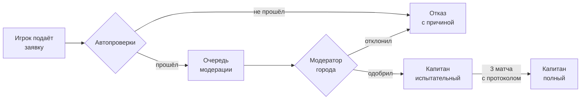
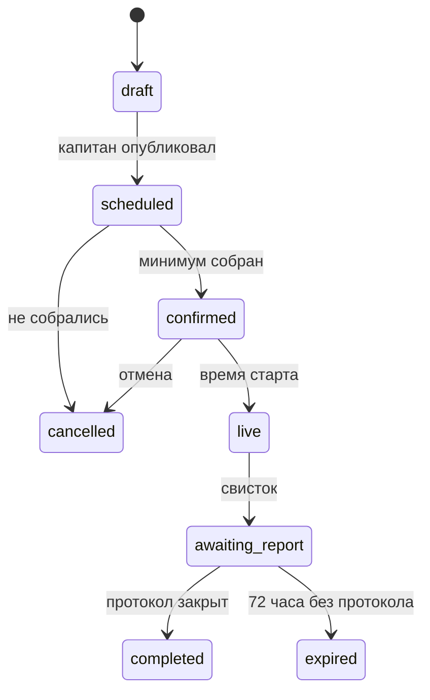
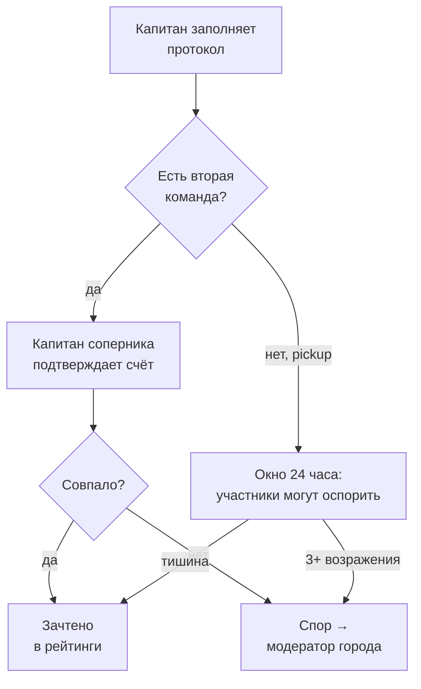
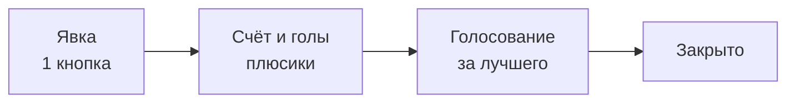

# Домен и правила

Сущности продукта и правила, которые должны соблюдаться в коде и в схеме БД. Это спецификация для реализации, а не продуктовое обоснование — оно в product/.

## Роли и верификация капитанов

Роль — это не галочка в профиле, а набор прав в конкретном контексте (глобально / город / команда / матч). Это важно заложить сразу — переделывать потом дорого.

| Роль | Область | Может |
| --- | --- | --- |
| Гость | — | Смотреть витрину города, 1 матч в деталях, не может подать заявку |
| Игрок | Аккаунт | Профиль, заявки в команды, участие в матчах, статистика |
| **Капитан** | Одна команда | Создать команду, матчи, состав, вести протокол, добавлять поля |
| Вице-капитан | Одна команда | Всё, кроме роспуска команды и смены капитана |
| Модератор города | Город | Подтверждать капитанов и поля, разбирать жалобы |
| Админ | Глобально | Всё + биллинг, фича-флаги, доступы |

В базе это одна таблица `role_assignments (user_id, role, scope_type, scope_id)`, а не поле `role` в `users`. Иначе при первой же задаче «человек капитан в одной команде и обычный игрок в другой» всё развалится.

### Как становятся капитаном



Автопроверки на MVP: подтверждённый телефон, возраст 14+, заполненный профиль, нет активных банов, не капитан другой команды в этом городе. В форме заявки — город, предполагаемое поле, формат (5×5, 6×6, 8×8, 11×11), частота игр, ссылка на чат или соцсеть. Модератор видит это одним экраном и жмёт одну кнопку.

### Почему испытательный статус

Капитан-испытательный ведёт команду полноценно, но его протоколы не идут в городские рейтинги и таблицы бомбардиров. Так ты пускаешь людей в продукт быстро, но не пускаешь мусор в публичные цифры.

### Смена и потеря капитана — самый часто забываемый случай

Капитан удалил аккаунт, забросил команду, получил бан — команда из 10 человек не должна умирать. Правила:

- Капитан может передать роль любому игроку команды — тот подтверждает.
- Без активности капитана 60 дней вице-капитан может запросить передачу через модератора.
- Бан капитана не удаляет команду и не стирает сыгранные матчи; команда встаёт на паузу до нового капитана.

### Капитан меняет город

Правило «один капитан — одна команда» действует в пределах города, поэтому при смене города в профиле система останавливает человека и спрашивает прямо: «Вы капитан «Быков» в Ставрополе. Остаётесь капитаном или передаёте команду?»

Три варианта ответа: остаться капитаном удалённо (можно — люди ездят и возвращаются), передать роль вице-капитану, или поставить команду на паузу. Заявка на капитанство в новом городе блокируется, пока этот вопрос не закрыт.

### Кто назначает вице-капитана

Только капитан, и только из активного состава. Модератор города не может назначить вице-капитана сам — он участвует только в сценарии «капитан пропал на 60 дней», и только по запросу самой команды. Один вице-капитан на команду.

## Команды

Один капитан — одна команда в пределах одного города. Глобально запрещать вторую команду не надо: человек может переехать. думаю тут просто после смены города должна быть проверка что вот вы капитан там то, подтвердите что вы им являетесь или смените команду что-то такое&#32;

### Нейминг

Капитан вводит «Быки» → система хранит три поля:

| Поле | Значение | Уникальность |
| --- | --- | --- |
| `name` | Быки | нет |
| `display_name` | Быки Вашингтон | нет (генерится) |
| `slug` | `us-washington-byki` | **глобально уникален** |

Уникальный индекс ставится на пару `(city_id, normalized_name)`, где `normalized_name` — нижний регистр без пробелов и диакритики. Иначе получишь «Быки», «БЫКИ» и «Быки » в одном городе. Отдельно нужен фильтр на гомоглифы — латинская `a` вместо кириллической в названии команды и нике — иначе клоны пройдут все проверки.

Переименование — не чаще раза в 90 дней, с сохранением старого slug на редирект. Иначе команды будут менять имя после каждого проигрыша и вся история потеряет смысл.

### Состав

Капитан задаёт лимит состава при создании, но не любой: система считает его от формата. Для 5×5 — от 5 до 12, для 8×8 — от 8 до 18, для 11×11 — от 11 до 25. Верхняя граница убивает команды-свалки на 100 человек, нижняя — команды на двоих ради красивого названия.

Статусы участника: `pending` → `active` → `left` / `removed`. История членства не удаляется никогда — иначе статистика «за какие команды я играл» развалится.

Игрок может состоять в нескольких командах — в реальности люди играют и с работой, и с двором. Но на один матч он может быть заявлен только за одну команду, и система предупреждает о пересечении по времени с другим матчем.

### Возрастные ограничения команды и матча

Идея рабочая и закрывает сразу две задачи: школьники не попадают в состав к взрослым мужикам, а ветеранские составы 35+ не собирают случайных студентов.

Капитан задаёт у команды `min_age` и `max_age` — оба необязательны. У матча свои поля: по умолчанию наследуются от команды, но могут быть смягчены или ужесточены под конкретную игру. В интерфейсе — готовые пресеты: без ограничений, 14–17, 18+, 30+, 35+, 45+.

Шесть правил, без которых это сломается:

1. **Проверка по возрасту на дату матча**, а не на дату заявки. Иначе человек «взрослеет» посреди турнира и логика рассыпается.
2. **Не прячь матч целиком.** Игрок видит его в ленте, но кнопка заявки заблокирована с понятной причиной («Матч для игроков 35+»). Скроешь — человек решит, что в городе пусто.
3. **Действующий состав не выкидывается** при изменении порога. Капитан получает список тех, кто перестал подходить, и решает сам.
4. **Порог ниже минимального возраста страны недоступен** — берётся из `min_signup_age` страны города.
5. **Возраст остаётся скрытым.** Капитану показывается только «подходит / не подходит», а не дата рождения чужого человека.
6. **Смешанный состав** — если в матче есть несовершеннолетние, капитан видит подсказку об ответственности. Именно подсказку, а не блокировку — во дворе это норма.

Возрастной диапазон становится и фильтром в ленте города — это сразу даёт два естественных сегмента: школьный футбол после уроков и ветеранский по выходным.

### Вторая команда капитана — нет, но

Ты спрашивал, может ли капитан делать две команды, чтобы собрать матч. Это не надо решать через вторую команду — это решается **открытым матчем без второй команды** (см. раздел «Матчи»): капитан создаёт матч на 20 слотов, свои 10 занимает команда, остальные открываются городу. Делать фиктивную вторую команду — значит самому сломать статистику, ради которой всё строится.

## Поля и слоты

На MVP поля добавляют капитаны вручную, модератор города подтверждает. Интеграция с букингом полей невозможна: большинство российских объектов не публикуют даже цены, не то что API.

### Поле в базе

Поле: название, адрес, координаты (lat/lon), город, покрытие (искусственный газон / земля / паркет / асфальт), тип (открытое / крытый манеж), размер и форматы, освещение, раздевалки, платное/бесплатное, типовая цена за час, телефон администратора, фото, кто добавил, статус модерации.

Бесплатные коробки во дворах — отдельный тип поля с пометкой «без брони». Для них контроль слотов работает как предупреждение, а не как запрет — на дворовой коробке две компании реально могут договориться на месте.\
\
так же все поля должны пока нет карт вручную админом проверяться и подтверждаться&#32;

### Дубли

Ручной ввод гарантированно даст три записи на одно поле. При создании показывай существующие поля в радиусе 150 м и спрашивай «это одно из них?». В админке — очередь похожих полей и кнопка «слить», которая перевешивает все матчи на основное.

### Запрет двойного бронирования

Это тот случай, где проверка в коде недостаточна: два капитана могут нажать «Создать» в одну миллисекунду. Защита должна быть в PostgreSQL:

```
ALTER TABLE matches ADD COLUMN slot tstzrange
  GENERATED ALWAYS AS (tstzrange(starts_at, ends_at, '[)')) STORED;

CREATE EXTENSION IF NOT EXISTS btree_gist;

ALTER TABLE matches ADD CONSTRAINT no_overlap_on_pitch
  EXCLUDE USING gist (pitch_id WITH =, slot WITH &&)
  WHERE (status IN ('scheduled','confirmed') AND pitch_bookable = true);
```

Одна строка в схеме закрывает весь класс багов, который иначе будешь ловить годами. Отменённые матчи выпадают из ограничения автоматически.

Добавь технический зазор: матч на 2 часа блокирует слот + 10 минут после, чтобы люди успели разойтись.

### Геоиерархия

Страна → регион → город → район. Города — справочник с собственными id, а не строка в профиле. Базу городов берём из GeoNames (открытая лицензия CC BY) и включаем только города, где есть хотя бы один подтверждённый капитан — иначе пользователь выберет город и увидит пустоту.

## Матчи и тренировки

У матча есть тип, и это главное решение в продукте. Три типа покрывают всё, что ты описал.

| Тип | Суть | Идёт в статистику |
| --- | --- | --- |
| `friendly` | Две команды друг против друга | Да: счёт, голы, ассисты, рейтинги |
| `pickup` | Один капитан собирает N слотов, делит на две стороны на месте | Частично: участие да, голы да, командный результат нет |
| `training` | Тренировка своей команды | Только посещаемость |

`pickup` решает твой вопрос про вторую команду без фейковых команд.\
\
тут же надо добавиь турнир, где будут добавлять команды и турнирная таблица, сетка и т д&#32;

### Жизненный цикл матча



`expired` обязателен. Без него у тебя через полгода будет тысяча «идущих» матчей, которые засорят все экраны.

### Закрытый / открытый

Не галочка, а три уровня видимости: `team_only` (только свои), `invite_only` (виден в городе, но вход по одобрению капитана), `public` (занимай слот сам). Средний — самый востребованный в реальной жизни.

### Позиции и сменный вратарь

У каждого слота в матче есть позиция: GK, DEF, MID, FWD или ANY. Капитан задаёт раскладку при создании.

Режим сменного вратаря — хорошая идея, которой ни у кого нет. Работает так: капитан включает флаг и ставит длину отрезка (например, 10 минут или по кол-ву голов). Приложение генерит очерёдность из всех полевых игроков, показывает её на экране матча и даёт таймер с звуком: «Сейчас в воротах Миша, следующий — Серёга». Минуты на воротах попадают в статистику — это маленькая, но очень узнаваемая деталь для тех, кто играет во дворе.

### Как найти соперника

Капитан создаёт **вызов** — отдельная сущность: поле или район, дата или окно дат, формат, стоимость пополам, уровень. Другие капитаны города видят ленту вызовов и отвечают. Первый принятый ответ превращает вызов в матч и блокирует слот поля.

Вызовы — самый сильный движок ликвидности в продукте: один капитан своим действием поднимает 20 человек, а не одного.\
\
должны быть пуши, например если игрок в городе И и кто-то создал там команду/матч ему приходит что-то типа в вашем городе была создана .....

## Деньги за аренду: мы их не трогаем

**Платформа никогда не принимает, не хранит и не переводит деньги за аренду.** Это не этап MVP, а постоянное архитектурное решение. Мы только считаем и показываем, кто сколько должен взять с собой. Расчёт между игроками и капитаном идёт наличными или их собственными переводами, мимо нас.

Это снимает целый класс проблем: не нужны эквайринг, касса, возвраты, споры, лицензии на переводы и разбор налогового режима в каждой новой стране. Мультистрана при таком подходе становится реальной, а не многолетним проектом по получению разрешений.

### Как считается

Капитан вводит цену за час и длительность — всё остальное делает приложение.

| Шаг | Пример |
| --- | --- |
| Цена за час | 3 000 ₽ |
| Длительность | 2 часа |
| Итого за поле | 6 000 ₽ |
| Делится на | всех подтверждённых участников **обеих команд** |
| При 20 игроках | 300 ₽ с человека |
| При 16 игроках | 375 ₽ с человека |

Игрок видит одну строку на карточке матча и в напоминании за 2 часа: «Возьми 300 ₽, отдать — Алексею». Кто получатель — отдельное поле матча: часто за поле платит не капитан, а тот, кто приехал раньше.

### Три детали, которые легко пропустить

1. **Считаем по факту, а не по плану.** Сумма пересчитывается при каждом изменении состава. Показывай вилку: «сейчас 375 ₽, при полном составе — 300 ₽». Это самая дешёвая мотивация звать людей, которая у тебя есть.
2. **Капитан ведёт реестр галочками** «отдал / не отдал». Это не платёж, а заметка — юридически то же самое, что блокнот. тут можно помечать кстати игроков которые например не платят, капитан можт ставить профилю статус не заплатил, чтоб другие команды и игроки видели это и может так же снимать таукю галочку. но нужно злоупотребление этим тоже как-то учесть&#32;
3. **Долг виден только капитану и самому игроку.** Публичный список должников — токсично и развалит команды. а вот тут я выше описал, давай тогда если у одного игрока несколько таких не оплат появляется от одного или разных источников то тогда его эта особенность становистя публичной и какой-то бейдж типа не платежный игрок

### Метка неплательщика

Самая опасная механика в документе, поэтому правила жёсткие. Одна метка от обиженного капитана не должна ломать человеку репутацию в городе.

| Событие | Что видно |
| --- | --- |
| Первая неоплата | Только капитану и самому игроку. Забыл или не было с собой — нормальная ситуация |
| Вторая от того же капитана | По-прежнему приватно |
| **Две от разных капитанов из разных команд** | Метка становится публичной — бейдж виден капитанам при рассмотрении заявки |
| Следующая оплата подтверждена | Метка снимается автоматически |
| 90 дней без новых меток | Сгорает сама |

Защита от злоупотребления — четыре механизма. Метки от одного капитана никогда не суммируются в публичный статус, сколько бы их ни было. Игрок видит каждую метку сразу и может оспорить через модератора. Капитан, у которого доля меток аномально высокая, сам попадает в очередь модерации. И поставить метку можно только на матче с подтверждённой явкой этого игрока и с указанной суммой аренды — на бесплатном матче кнопки просто нет.

Формулировка бейджа важна: не «Должник» и не «Не платит», а нейтральное «Спорные расчёты» с числом случаев. Суммы не показываем никому — мы не сторона расчётов и не подтверждаем факт долга, а только показываем, что несколько капитанов отметили проблему.

Бесплатный матч — флаг `is_free`, и весь денежный блок просто не рисуется.

### Технически

Суммы только `int64` в минорных единицах (копейки, центы) + код валюты ISO 4217. Никакого float. Деление — целочисленное, остаток раскидывается по первым N игрокам в стабильном порядке, чтобы сумма долей точно сошлась с арендой.

В интерфейсе и в пользовательском соглашении формулировка должна быть однозначной: это справочный расчёт между участниками, платформа не сторона расчётов и не гарантирует исполнение. Текст соглашения — к юристу, но смысл закладываем в продукт сейчас.

## Профиль игрока

Профиль — это карточка игрока, а не анкета. В этом вся эмоция продукта.

### Что храним

**Обязательно:** ник (уникален глобально), аватар (для бесплатного станлдартный не меняемый), город, год рождения, основная позиция.

**Опционально:** имя, рабочая нога (левая/правая/обе), рост, номер на футболке, любимый клуб, девиз, вторая позиция, предпочитаемое время игр (будни вечером / выходные утром). уровень подготовки, новичок, новичок + любитель, любитель + и так далее

### Уровень подготовки

Лестница: новичок → новичок+ → любитель → любитель+ → опытный → опытный+ → полупрофи. Шесть-семь ступеней — потолок: больше люди не различают, меньше — не работает как фильтр.

Уровень ставит сам игрок — и это сразу создаёт известную проблему: все ставят себе выше, чем есть. Решение — **две цифры рядом**: заявленный уровень и подтверждённый, который считается из оценок соперников после матчей. После 10 матчей вторая цифра становится основной, и фильтры в ленте работают по ней.

Уровень — бесплатное поле всегда, по той же причине, что и позиция: это топливо матчмейкинга.

Про дату рождения: храни полную (нужна для возрастных ограничений и ветеранских турниров 35+/45+), показывай только возраст. По умолчанию скрыт.

### Ники

Уникальный индекс по нормализованному нику (нижний регистр, без точек и подчёркиваний, без гомоглифов). Зарезервируй стоп-лист служебных слов (`admin`, `support`, `moderator`, имена бренда) до запуска. Смена ника — раз в 90 дней и толкьо на не сушествующий, старый ник висит в карантине 90 дней, чтобы никто не перехватил чужую репутацию.

### Позиция: что бесплатно, что платно

Ты предложил сделать выбор позиции платным. Здесь нужно развести две разные вещи:

- **Позиция в профиле** (кем я играю вообще) — бесплатно всегда. Это твой главный сигнал для матчмейкинга. Брать за него деньги — значит самому себе сломать данные. согласен
- **Бронь позиции в конкретном матче** — вот это можно монетизировать. Игрок с подпиской при записи выбирает свою позицию; без подписки ставит капитан. да именно так и хотел и еще можно за деньги сделать чтоб никогда на ворота не могли тебя поставить например

Важное ограничение: капитан всегда может перебить бронь, иначе подписка превращается в pay-to-win против собственной команды и создаёт конфликты. При перебитии игрок видит уведомление. вот тут надо бы как-то продумать еще, все же пользователь заплатил за эту возможность. я например специально заплатил чтоб быть нападающим а меня капитан специально будет стаивть вратарем, я тогда больше не буду платить и все, тут надо какие-то реальные условия сделать и продумать

**Принятое решение по брони.** Капитан не может просто перебить оплаченную бронь. Он может её снять только тогда, когда позиций на всех не хватает — и только с явной причиной из списка. Механика:

| Что происходит | Результат |
| --- | --- |
| Капитан снимает бронь | Игрок получает пуш с причиной и компенсацию: бронь на следующий матч бесплатно + очки |
| Три снятые брони у одного игрока за сезон | Больше капитан снять не может — кнопка заблокирована |
| Капитан снимает брони систематически | Флаг в админке, это видно в паспорте команды |

Счётчик снятых броней персональный и привязан к паре «игрок — команда», иначе капитан будет снимать по кругу у разных людей.

Отдельная платная опция — **«Никогда не на ворота»**. Работает и в режиме сменного вратаря: такой игрок просто не попадает в очерёдность. Но если таких игроков в матче оказалось столько, что в ворота некому — опция отключается для всех в этом матче, и все получают компенсацию. Иначе продажа этой опции приводит к матчам без вратаря.

### Аватары

Идея с карикатурами на звёзд хорошая коммерчески, но так делать нельзя: узнаваемое изображение реального игрока — это его право на изображение и коммерческие права клубов, и продавать это за подписку — прямой иск от правообладателей.&#32;

Рабочая альтернатива, которая даст тот же эффект: **собственные архетипы дворового футбола**: «Дядя с завода», «Студент-технарь», «Стенка», «Вратарь в свитере». Это твоя собственная IP, её можно масштабировать на стикеры, мерч и рефералки, и её никто не отзовёт. да, можно и так, нужно с десяток таких аватаров а лучше под 20.  но прям крутое и прикольное надо&#32;

Аватары выдаются тремя путями: базовые всем, редкие за достижения, эксклюзивные за подписку. Заработанный аватар ценнее купленного — не ломай это. да и платный пользователь сам может выбрать какой из аватаром ему поставить, заработанный или купленный. так же еще уникальыне достижения нужны и шильдики. типа за созданные матчи, сыгранные матчи и так далее, чтоб у пользователя было желание развиавться

### Достижения и шильдики

Стартовый пак — около 20 архетипов, чтобы человек находил «себя», а не выбирал из трёх картинок. Платный пользователь сам решает, что ставить — заработанный аватар или купленный. Бесплатный — стандартный неизменяемый.

Достижения делятся на четыре ветки — важно, чтобы каждый тип игрока нашёл свою:

| Ветка | Примеры |
| --- | --- |
| Участие | 10 / 50 / 100 / 250 сыгранных матчей, год без пропусков, зимний матч при минусе |
| Спорт | Первый гол, хет-трик, сухая серия вратаря, золотой мяч города за сезон |
| Надёжность | 20 матчей подряд без неявки, ни одного опоздания за сезон |
| Организатор (капитан) | 10 / 50 созданных матчей, приведённые новички, сезон без единой отмены |

Ветка «Надёжность» — самая важная из четырёх: она превращает скучное «приходи вовремя» в то, что можно показать. Именно она лечит главную боль всего любительского футбола.

Шильдики (рамки карточки) даются за редкие вещи и **не продаются никогда** — это то, что отличает заработанное от купленного. Прогресс по каждой ветке виден в профиле полоской — без этого достижения не работают как мотивация.

Анимация, как ты предложил, живёт не на голе, а в рейтинге: открываешь топ города, жмёшь на первое место — карточка разворачивается с анимацией его аватара. Это дешевле в разработке и видно всему городу, а не двум человекам на поле.

### Статистика в профиле

Матчи, голы, ассисты, победы/ничьи/поражения, минуты на воротах, серия посещаемости, средняя оценка, достижения, история команд. Отдельно — **надёжность**: процент явки после подтверждения. Это самая важная цифра в профиле для капитана, который решает, брать ли человека.  вот тут бы тоже как-то сделать верификацию бы, чтоб не было что игрок "нафармил" статистику&#32;

### Карточка надёжности — то, что капитан смотрит перед тем, как взять человека

Зеркально паспорту команды. Главный вопрос капитана — не «как он играет», а «он вообще приедет?».

| Метрика | Как считается |
| --- | --- |
| Явка | Пришёл / подтвердил за последние 10 матчей |
| Отклики → игры | Сколько раз подавал заявку и сколько раз реально вышел |
| Поздние отказы | Отмены меньше чем за 3 часа до старта |
| Опоздания | Отметки капитана за последние 10 матчей |
| Серия | Сколько матчей подряд без неявки |
| Среднее время ответа | От приглашения до реакции |

На экране это один значок и одна фраза: «18 из 20 — приезжает» или «7 из 20 — часто сливается». Никаких баллов от 0 до 100 — их никто не читает.

Три правила, чтобы это не стало травлей. Новичок до 5 матчей — бейдж «Новичок» без цифр, иначе его никто никуда не возьмёт. Отмена матча капитаном не портит явку игрокам. И плохая статистика самоочищается за 20 матчей — человек должен иметь шанс исправиться. нужно через запрос обновлять тогда, через 10-20 матчей плохой статы появляется кнопка запросить сброс

## Статистика, рейтинги и античит

### Паспорт команды — самый недооценённый экран всего продукта

Игрок перед вступлением должен понимать, во что он влезает. Все конкуренты показывают только название и логотип. Мы показываем здоровье команды цифрами.

| Метрика | Как считается | Зачем игроку |
| --- | --- | --- |
| Ритм игр | Матчей в месяц за последние 90 дней | «Играют 4× в месяц» или «раз в месяц» |
| Средняя явка | Пришло / подтвердило, медиана по матчам | «Собирается 9 из 10» вместо «5 из 10» |
| Заполняемость состава | Средний % закрытых слотов к старту | Будет ли вообще игра |
| Отмены | Отменёно / создано за 90 дней | Главный красный флаг |
| Переносы | Смен даты/времени после публикации | Насколько можно планировать вечер |
| Стабильность ядра | Сколько человек сыграли 5+ матчей подряд | «Живая команда» или «проходной двор» |
| Типичный день и время | Мода по истории матчей | «Четверг, 20:00» — подходит ли график |
| Средняя цена с человека | Медиана доли аренды | Потянет ли по деньгам |
|  | может еще что упустили но что будет полезно каждому.&#32; |  |

Два правила, без которых это обернётся против тебя. Первое: цифры появляются только после 5 сыгранных матчей, до этого — бейдж «Новая команда», иначе одна отмена из одного матча даст «100% отмен» и убьёт команду в день создания. Второе: всё считается за скользящие 90 дней, чтобы команда могла исправиться, а не тащила за собой провальный прошлый год.

Технически: таблица `team_stats_daily` с пересчётом ночью, а не агрегат по всей истории на каждый открытый экран.\
\
так же тут можно наверное делать запрос на сброс тсатистики (например сменился капитан, хочет чтоб прошлая стата не уыитывалась)&#32;

### Рейтинг команды в городе

Два разных рейтинга, их нельзя смешивать: **спортивный** (Elo по очным матчам между командами) и **надёжность** (явка, отмены, переносы). Слабая, но надёжная команда — отличный вариант для новичка, и фильтр должен её показывать.

### Античит: как защититься от выдуманных голов

Твоя идея «только капитан отмечает» недостаточна: капитан сам играет и сам себе пишет хеттрики. Рабочая схема — **консенсус двух сторон плюс окно оспаривания**:



Дополнительные замки:

1. **Сумма голов игроков = счёт команды.** Простая проверка, которая режет половину фантазий.
2. **Потолок правдоподобия.** Больше 15 голов за матч от одного игрока — автофлаг в админку, не блокировка.
3. **Голы засчитываются только тем, кто отмечен в составе** и подтвердил участие сам (один тап в пуше после матча).
4. **Репутация капитана падает от споров.** Два проигранных спора — протоколы уходят на ручную модерацию.
5. **Золотой мяч и топы строятся на голосах соперников, а не своих.** Лучший игрок матча — голосование обеих команд, голос за себя не считается.

Главная мысль: не пытайся сделать статистику неподдельной. Сделай так, чтобы накрутка была видна другим и стоила репутации в своём же районе.\
\
кстати да после матча нудно голосование за лучшего где всем игрокам предложится выбрать, и вообще нужэно да продумать как удобно отмечать и тех кто пришел и кто забил чтоб это не было сложно и рутинно. например одной кнопкой подтверждать если пришли все кто откликнулся, и если не ее нажать то впадаюший список где уже могут выбрать кто не пришел, как-то так.. в общем туит надо и легко и понятно и при этому функционально все продумать.  а главное с напонималками и так далее, чтоб не было что матч сыгран а никто ничегр не отметил и все, ну точнее можно и так, но тогда никакая статистика не должна учитываться портиться и так далее. просто может есть те кто не хочет в интерактиве участвовать и приходит реальн опросто мяч попинать и ему пофиг на статистики и так далее&#32;

### Как закрывается матч — три экрана, не больше

Самый рискованный момент продукта: матч кончился, все устали и хотят домой. Если закрытие протокола занимает больше минуты, его не будут делать, и вся статистика умрёт.



**Экран 1 — явка.** Одна большая кнопка «Пришли все». Если кто-то не пришёл — капитан жмёт вторую кнопку и снимает галочки с тех, кто слился. В 90% случаев это один тап.

**Экран 2 — счёт и голы.** Список состава с плюсиками напротив фамилий. Минуты голов не спрашиваем вообще — их никто не помнит. Сумма плюсиков должна сойтись со счётом, иначе кнопка «Готово» не загорается.

**Экран 3 — лучший игрок.** Голосуют все участники, а не капитан. Голос за себя не считается, окно голосования — 24 часа, при менее чем трёх голосах лучший игрок просто не присуждается.

### Если протокол никто не заполнил

Ты верно заметил: есть люди, которые пришли просто попинать мяч и им плевать на статистику. Поэтому правило такое:

Незакрытый матч через 72 часа уходит в `expired` и **не учитывается нигде**: ни в статистике игроков, ни в надёжности, ни в паспорте команды. Он никому ничего не портит — просто его как будто не было. Это важно: команда, которая не хочет возиться со статистикой, должна мочь пользоваться приложением только ради сбора людей.

Напоминания: через 1 час после конца капитану, через 12 часов — ещё раз ему и вице-капитану. Больше не долбим.

### Защита от нафармленной статистики

Главный сценарий накрутки — не выдуманные голы в реальном матче, а **выдуманные матчи**: два друга создают десяток игр в неделю и пишут друг другу хет-трики. Четыре проверки:

1. **Минимум участников.** Матч, где отмечено меньше игроков, чем требует формат, в рейтинги не идёт.
2. **Разнообразие состава.** Если последние 20 матчей игрока — это одни и те же четыре человека, вес его статистики в городских таблицах падает.
3. **Геометка на поле.** Необязательный чекин на месте даёт матчу повышенный вес. Не обязательный — потому что в манежах нет GPS.
4. **Аномалии в админку.** Резкий рост частоты матчей или голов у одной команды — флаг модератору, не автобан.

### Сброс статистики по запросу

Два сценария, оба реальные. Игрок с плохой надёжностью после 10 матчей без нарушений получает кнопку «Запросить сброс» — старые неявки уходят в архив, счётчик начинается заново, один раз в год. Команда при смене капитана может запросить сброс командной статистики — через модератора города и с пометкой в паспорте: «Статистика с марта 2027». Стирать без следа нельзя — иначе сброс станет способом прятать отмены.

## Турниры

Турниры — это v2, и вот почему. Турнир из 8 команд требует, чтобы в городе уже было минимум 20 живых команд с нормальной явкой. Сделаешь раньше — получишь турниры на три команды, две из которых сливаются после первого тура, и это убьёт доверие к формату надолго.

### Форматы, которые нужны

| Формат | Когда работает |
| --- | --- |
| Однодневный кубок (4–8 команд, плей-офф) | Первый формат для запуска — помещается в один выходной |
| Круговой сезон | Есть 6+ команд, готовых играть 2 месяца |
| Группы + плей-офф | От 12 команд |
| Лига с дивизионами и вылетом | От 30 команд в городе — это уже отдельный бизнес |

### Кто создаёт

Ты предложил отдать создание турниров капитанам с подпиской. Это верно как направление, но не как первый шаг. Порядок такой:

1. **Сначала турниры проводишь ты сам** — вручную, в своём городе. Это лучшая маркетинговая механика на старте и способ понять, что реально ломается.
2. **Потом — модераторы городов.**
3. **Потом — капитаны с подпиской и репутацией** — минимум 20 сыгранных матчей, нет проигранных споров.

### Про призы — важно

Как только появляется денежный призовой фонд и взносы за участие, ты перестаёшь быть приложением и становишься организатором мероприятий с деньгами третьих лиц. В разных юрисдикциях это требует отдельной проверки — вплоть до квалификации как азартной игры, если взнос формирует приз. До юриста — только неденежные призы: кубок, мерч, бейдж в профиле, часы аренды от партнёрского манежа.

### Что надо заложить в архитектуру сейчас

Матч должен иметь необязательное поле `competition_id` с самого начала. Тогда турнир будет надстройкой над существующими матчами, а не параллельной вселенной, которую придётся писать с нуля.

