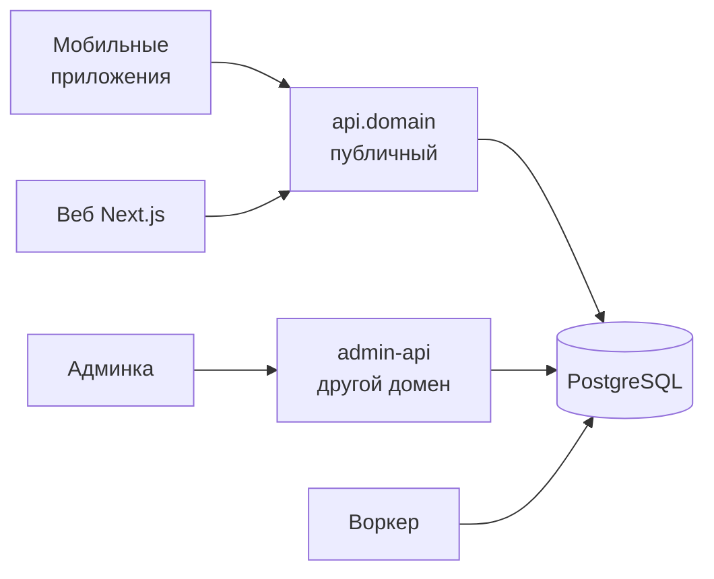
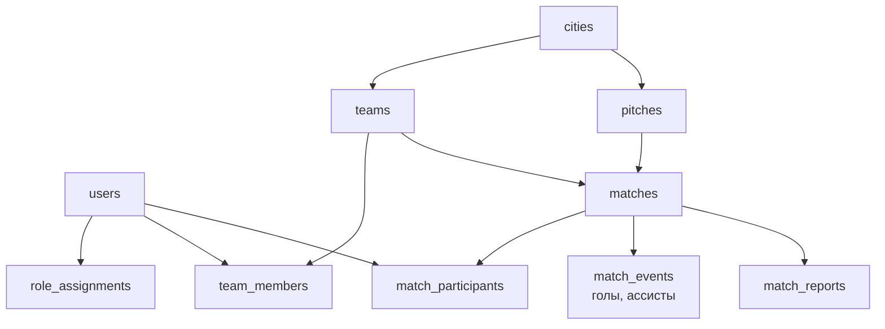

# Архитектура и инфраструктура

Стек, структура репозитория, модель данных, API, безопасность и масштабирование.

## Технический стек

Go на бэкенде — правильный выбор для этой задачи. Остальное с обоснованием.

| Слой | Выбор | Почему именно так |
| --- | --- | --- |
| Язык бэкенда | Go 1.27+ | Один бинарник, дешёвый хостинг, предсказуемая память |
| HTTP | `net/http` + chi | Стандартная библиотека закрыла роутинг; тяжёлый фреймворк не нужен |
| База | **PostgreSQL 18** | Гео (PostGIS), `EXCLUDE` для слотов, JSONB, полнотекст, частичные индексы |
| Доступ к БД | `pgx` + `sqlc` | Типобезопасный SQL без ORM. ORM на гео- и статистических запросах будет мешать |
| Миграции | `goose` (библиотекой, `cmd/migrate`) | Версионирование схемы с первого дня |
| Кэш | Valkey — вне каркаса | Очередь задач (River) и идемпотентность (`idempotency_keys`) живут в Postgres. Кэш — сессии, rate limit, ленты — решается в спеке бэкенда, если понадобится |
| Фоновые задачи | River (Go, очередь на Postgres) | Напоминания, пересчёт статистики, рассылки. Без Kafka до 100k пользователей |
| Файлы | S3-совместимое хранилище | Аватары, фото полей, гербы |
| Пуши | FCM + APNs через свой сервис | Своя абстракция, чтобы добавить RuStore/Huawei потом |

### Мобильные клиенты — главное решение проекта

У тебя React и Vue в руках, нативной мобильной команды нет. Значит **React Native через Expo** — одна кодовая база на iOS и Android, OTA-обновления без ревью сторов, твой же React. Для этого продукта нет ни одной задачи, где RN упирается в потолок: нет ни видеообработки, ни 3D, ни фонового трекинга.

Flutter тоже рабочий вариант, но потребует выучить Dart и не даст переиспользовать логику с вебом. Натив (Swift + Kotlin) — две команды вместо одной и удвоение сроков; для MVP это самоубийство.\
я наоборот думаю надо флаттер сразу брать, реакт натив это утопия и слабое решение с кучей подводных камней особенно на иос. главное на веб версии чтоб флаттер работал корректно&#32;

**Решение: Flutter для приложений, Next.js для публичного веба.** Твой выбор рабочий: один язык, один рендерер, одинаковая картинка на обеих платформах и нет сюрпризов с нативными мостами.

Но одно ограничение надо знать точно: **Flutter Web рисует в canvas**, а не в DOM. Для публичных страниц это плохо по трём причинам: тяжёлый первый загруз на мобильном интернете, слабая индексация и проблемы с превью ссылки при шеринге. А именно шеринг матча и страницы команд в поиске — твои два бесплатных канала роста.

Поэтому граница такая:

| Что | На чём |
| --- | --- |
| iOS и Android | Flutter |
| Публичные страницы: матч, команда, игрок, город, таблицы | Next.js (SSR, индексируется, OG-превью) |
| Личный кабинет в вебе (MVP веб-фирст) | Next.js — там же, без второй сборки |
| Админка | React + Vite |

Так как ты стартуешь с веба, первым пишется Next.js, а Flutter подключается к тому же API когда веб уже работает. Это же снимает вопрос с юрлицом и сторами на несколько месяцев.

### Веб

Next.js на React. Публичные страницы команд, игроков и городов рендерятся на сервере и индексируются. Это не косметика: страница команды в поиске — это тот самый канал, который 13 лет кормит FindSport. Матч шерится ссылкой, которая открывается без установки приложения — без этого капитан не сможет звать людей из Telegram, а это его главный инструмент. не толкьо телеграм. отовсюду звать

### Инфраструктура

Docker + один VPS с managed Postgres на старте. Kubernetes на MVP — расход времени без выгоды. Обязательно с первого дня: миграции в CI, структурные логи (`slog`), OpenTelemetry, автобэкапы с проверкой восстановления. согласен, главное чтоб при расширении все легко и безопасно расщирялось

## Архитектура

**Модульный монолит.** Не микросервисы. Микросервисы решают проблему команд из 50 человек, а не проблему нагрузки. Один Go-бинарник с чёткими внутренними границами спокойно держит сотни тысяч пользователей.

### Структура репозитория

```
backend/
  /cmd
    /api           — HTTP API для приложений и веба
    /admin-api     — ОТДЕЛЬНЫЙ бинарник для админки
    /worker        — фоновые задачи и пуши
    /migrate       — накат/откат миграций (goose как библиотека)
  /internal
    /identity      — аккаунты, сессии, роли
    /geo           — страны, города, районы, поля
    /teams         — команды, составы, заявки
    /matches       — матчи, слоты, вызовы, протоколы
    /stats         — агрегаты, рейтинги, таблицы
    /reputation    — надёжность, флаги, санкции
    /economy       — очки, кредиты, косметика, подписки
    /notify        — пуши, шаблоны, настройки
    /moderation    — очереди, жалобы, аудит
    /platform      — база, логи, конфиг, фича-флаги
  /migrations
contracts/
  /openapi         — public.yaml, admin.yaml — источник истины для кода и клиентов
apps/
  /web             — Next.js, публичный веб
  /admin           — React + Vite, админка
packages/          — общий код фронтов: @wf/config, @wf/tokens, @wf/i18n
```

Жёсткое правило: модули общаются **только через явные интерфейсы верхнего уровня и события**, никто не лезет в чужие таблицы напрямую. Это то, что потом позволит вырезать `stats` в отдельный сервис за день, а не за квартал. Страж границ модулей в Go — в спеке бэкенда; сейчас автоматически проверяется только граница админки (`backend/internal/archtest`).

### События внутри

Матч закрыт → событие `match.completed` → его независимо обрабатывают `stats`, `reputation`, `economy`, `notify`. События пишутся в таблицу `outbox` в той же транзакции, что и данные — иначе у тебя будут матчи без статистики и статистика без матчей.

### Граница админки — архитектурная, не только логическая



Админка живёт на отдельном домене, отдельном бинарнике и отдельном порту. Админские ручки **никогда** не висят на публичном API за проверкой роли — это самый частый способ потерять базу. домен может и отдельны но впс будет один и тот же точно&#32;

## Модель данных

Ключевые сущности и их связи. Остальное нарастёт сверху. перед ситиес сразу кантриес тоде надо учитывать

Справочник географии начинается с `countries`, а не с `cities`. У страны живут поля, которые иначе размажутся по коду: валюта, язык по умолчанию, формат телефона, первый день недели, `min_signup_age`, `age_of_majority`, флаги доступности функций.

**Валюта выбирается автоматически** — да, так делаем. Капитан выбрал город → город знает страну → страна знает валюту. Ручного выбора валюты в интерфейсе нет вообще: человек видит «₽» рядом с полем суммы и никогда не думает об этом. Валюта всё равно пишется в каждую запись матча — если город когда-то переедет в другую страну или валюта сменится, старые матчи не должны пересчитаться задним числом.



### Таблицы, которые нужно заложить сразу

| Таблица | Ключевое |
| --- | --- |
| `users` | `id`, `nickname`, `nickname_normalized` (UNIQUE), `birth_date`, `city_id`, `is_minor`, `locale`, `timezone`, `status` |
| `role_assignments` | `user_id`, `role`, `scope_type`, `scope_id` — без этого роли развалятся |
| `teams` | `slug` (UNIQUE), `name`, `city_id`, `format`, `roster_limit`, `captain_id`, UNIQUE `(city_id, name_normalized)` |
| `team_members` | `team_id`, `user_id`, `status`, `joined_at`, `left_at` — история не удаляется |
| `pitches` | координаты (PostGIS `geography`), `city_id`, `surface`, `is_bookable`, `moderation_status` |
| `matches` | `type`, `visibility`, `starts_at`, `ends_at`, `slot` (generated), `pitch_id`, `home_team_id`, `away_team_id` (nullable), `competition_id` (nullable), `rent_total`, `currency`, `is_free`, `payee_user_id` |
| `match_slots` | `match_id`, `side`, `position`, `user_id` (nullable), `is_reserved` |
| `match_participants` | `match_id`, `user_id`, `side`, `rsvp_status`, `attended`, `self_confirmed` |
| `match_events` | `match_id`, `minute`, `type`, `user_id`, `assist_user_id` |
| `match_reports` | `match_id`, `submitted_by`, `confirmed_by`, `state`, `disputed_at` |
| `reliability_snapshots` | пересчёт ночью, чтобы не считать на лету |
| `team_stats_daily` | то же для паспорта команды |
| `ledger_entries` | двойная запись по очкам и кредитам: `account`, `delta`, `reason`, `ref` |
| `audit_log` | кто, что, когда, с какого IP — всё, что делает админка |

### Три решения, которые дорого менять потом

1. **Валюта — всегда рядом с суммой.** Не выводи её из города на лету. валюта выбирается автоматически после выбора стран? можем так сделать?&#32;
2. **Время — всегда `timestamptz` в UTC** плюс отдельное поле `timezone` поля. Матч «в 20:00» — это время поля, а не телефона игрока, который может быть в отпуске.
3. **Удаление — только мягкое** (`deleted_at`) для всего, что участвует в статистике. Жёсткое удаление — только по запросу на удаление аккаунта, с анонимизацией вместо стирания строк.

### Индексы, которые понадобятся с первых тысяч матчей

Гео-индекс GIST по `pitches.location`; составной индекс `(city_id, starts_at)` на `matches` — это главный запрос всего продукта; частичный индекс по активным матчам (`WHERE status IN ('scheduled','confirmed')`) — он в десятки раз меньше полного.

## API и реалтайм

REST с контрактом OpenAPI, из которого генерируются типы для TypeScript. gRPC здесь не нужен: клиенты только внешние, внутренних сервисов нет, а цена — потеря простоты отладки.

### Версионирование

`/v1/...` в пути с первого дня. У мобильных приложений есть старые версии на телефонах месяцами — сломаешь контракт, сломаешь людям субботний матч. Отдельно нужен эндпоинт `/v1/app/min-version`, чтобы можно было принудительно попросить обновиться.\
\
сошласен, сразу при запуске проверяем версионность и просим обновитсья и так далее&#32;

### Идемпотентность — не опция

Мобильный интернет теряет ответы, люди жмут кнопку дважды. Все мутирующие запросы принимают заголовок `Idempotency-Key`, результат кэшируется на 24 часа. Без этого у тебя будут двойные заявки, двойные голы и двойные списания кредитов.

### Реалтайм — только там, где нужен

Вебсокеты стоят денег и сложности. Реально они нужны в двух местах: экран заполнения состава в последние часы перед матчем и чат матча. Всё остальное — обычный поллинг при открытии экрана плюс пуши.

### Пуши — главный канал удержания и главная причина удаления приложения

| Событие | Кому | Когда |
| --- | --- | --- |
| Новый матч команды | Составу | Сразу |
| Заявка в команду | Капитану | Сразу |
| Состав почти собран (осталось 2) | Городу по фильтрам | Один раз |
| Напоминание о матче + сумма | Участникам | За 24 ч и за 2 ч |
| Матч отменён | Участникам | Сразу, игнорируя тихие часы |
| Протокол ждёт | Капитану | Через 1 ч после конца |
| Ты в символической сборной недели | Игроку | Понедельник |

Два правила: тихие часы по часовому поясу игрока (кроме отмен) и тонкие настройки по категориям, а не одна кнопка «выключить всё». Человек, который отключил все пуши, уже потерян.\
да с пушами аккуратно чтоб это не было навязчиво и всегда было настраиваемо и полностью отключаемо&#32;

## Мультистрана и мультиязычность

Мультистрана — это четыре разные вещи, и три из них бесплатны, если сделать сразу, и очень дороги, если потом.

| Что | Как делаем сразу |
| --- | --- |
| Язык интерфейса | Все строки в файлах локализации с первого коммита, плюральные формы по ICU да сразу закладываем&#32; |
| Язык уведомлений | `users.locale` — пуш генерится на сервере на языке получателя |
| Время | UTC в базе, таймзона у поля, отображение в таймзоне матча |
| Деньги | Валюта у города, сумма в минорных единицах, без конвертации |
| Форматы | Даты, числа, первый день недели — по локали, не зашиты в код |

### Порядок языков

Русский и английский на старте. Дальше язык добавляется не когда «хочется выйти в страну», а когда там уже есть модератор и первые капитаны. Приложение на языке страны без матчей в ней — просто более дорогой способ разочаровать людей.

### Город — единица запуска, не страна

Это главный вывод из рынка. Footy Addicts сидит только в UK и делает около 6 000 игр в месяц. Pickup размазан по 80 городам в 8 странах и делает 50 игр в неделю. **Один город с 200 матчами в неделю ценнее, чем 50 городов по четыре.**

Поэтому в продукте есть понятие статуса города: `waitlist` (можно оставить заявку на капитана, но витрины нет), `pilot` (есть модератор и 3+ команды), `live`. Город в `waitlist` показывает честный экран: «Здесь пока 12 человек. Готов быть первым капитаном?» — это и механика роста, и защита от пустоты.

### Где белые пятна

По итогам анализа: Грузия — специализированного приложения не найдено вообще; Сербия и Балканы — только букинг с оплатой на месте; Казахстан — один MVP и один каталог. Турция и ОАЭ — самые вкусные по плотности, но там уже сидят сильные игроки.

## Админка

Админка разрабатывается параллельно, потому что без неё ты физически не сможешь подтвердить первого капитана. Она не вторична.

### Стек: React + Vite, не Next

Ты спрашивал, что надёжнее. Для админки — именно Vite, и вот почему. Админке не нужен SEO, не нужен SSR и не нужен Node-сервер в продакшене. Next добавляет серверный рантайм, то есть ещё один процесс с доступом к секретам и ещё одну поверхность атаки — ровно там, где нужно наоборот. Статика за реверс-прокси проще защитить и нечего ломать.

TypeScript, TanStack Query, генерация клиента из OpenAPI, готовая библиотека компонентов. Админка — не место для дизайна.\
\
но все равно делаем сразу и локали для админки и темную тему и все должно быть архитектурно круто, переиспользуемо, максимально аккуратно и по всем канонам

Три требования к админке с первого дня, и это не перфекционизм. Локализация — потому что модераторы городов будут из разных стран, и вшитые русские строки придётся выковыривать из сотни компонентов. Тёмная тема — потому что через токены цвета это один день работы, а потом — недели. И единая библиотека компонентов с одной таблицей, одной формой и одной очередью модерации на всё — очередей будет десяток, и писать каждую заново нельзя.

### Что в ней должно быть на MVP

1. **Очередь капитанов** — карточка заявки, две кнопки, причина отказа из списка.
2. **Очередь полей** — с картой, похожими полями и кнопкой «слить».
3. **Жалобы и споры по протоколам.**
4. **Поиск по пользователям** с действиями: бан, разбан, сброс ника, смена капитана команды.
5. **Города** — статусы, назначение модераторов.
6. **Дашборд здоровья** — матчей в неделю по городам, доля состоявшихся, средняя явка. Это твой главный экран как основателя.
7. **Фича-флаги** — включать функции по городам без релиза.\
\
статистика, возможность управлять матчами при разных спорных ситуациях,  короче все максимально учесть тое надо&#32;

### Аудит-лог

Каждое действие в админке пишется: кто, что, когда, над кем, с какого IP, старое и новое значение. Аудит-лог — append-only, удалять из него нельзя никому, включая тебя. Когда модераторов станет больше трёх, это окажется самой нужной таблицей в базе. согласен, полноченный аудит лог со всеми событиями а так же нужно логгирование самого приложения чтоб понимать тоже всякое&#32;

## Безопасность

### Аутентификация

Вход по телефону с кодом плюс Apple/Google Sign-In. Телефон — базовый барьер против массовой регистрации фейков и основа репутации. Паролей лучше не делать вообще — нет паролей, нет утечек паролей. может вход по почте? с подтверждением и через 2фа еще опциаонально может каждый ключить а еще о биометрии и пин коду наприме&#32;

**Решение по входу.** Почта как основной способ — хорошо для веб-фирст старта: дешевле SMS, работает в любой стране сразу, не требует договора с SMS-агрегатором и не даёт сжечь бюджет на SMS-переборе.

Итоговая схема:

| Слой | Что |
| --- | --- |
| Основной вход | Почта + код или magic link |
| Быстрый вход | Apple ID, Google, позже — VK/Telegram по рынкам |
| Второй фактор | Опционально, включает сам пользователь (TOTP или passkey) |
| На устройстве | Биометрия или PIN — это замок на приложение, не фактор аутентификации |
| Телефон | Необязателен, но подтверждённый телефон — условие для роли капитана |

Разница принципиальная: биометрия и PIN защищают открытое приложение на чужом телефоне, но не защищают аккаунт на сервере. Телефон остаётся условием для капитанства, потому что почта регистрируется за десять секунд и не даёт никакого барьера против фейковых команд.

Токены: короткий access (15 минут) + долгий refresh с **ротацией и детектом повторного использования**: если старый refresh пришёл второй раз — вся семья токенов отзывается. Сессии видны пользователю списком устройств с кнопкой «выйти везде».

### Админка — отдельный контур

Отдельный домен, отдельный бинарник, отдельные сессии. **Обязательный второй фактор** (TOTP или passkey) для всех сотрудников, без исключений и без «потом включим». Сессии админки — короткие, с перелогином на опасных действиях (бан, смена капитана, выдача роли). перелогин не надо по хорошему, у нас ест ьаудитлог есл ичто&#32;

**Про перелогин согласен — убираем.** Пока вас несколько человек, аудит-лог закрывает ту же задачу дешевле: видно, кто что сделал, и это нельзя стереть. Вместо перелогина ставим три вещи, которые не мешают работать: подтверждение вводом ника на разрушающих действиях, обязательная причина в поле, и окно отмены 60 секунд для банов и удалений. Обязательный второй фактор на входе в админку остаётся — это то, что отделяет «увели пароль» от «увели базу».

По возможности — админка только через VPN или с IP-аллоулистом. Пока вас двое-трое, это ничего не стоит.

### Что закрываем с первого дня

| Угроза | Мера |
| --- | --- |
| Перебор кодов из SMS | Rate limit по телефону и IP, задержка, лимит попыток |
| SMS-перебор на деньги (SMS pumping) | Лимиты по странам, капча при аномалии |
| IDOR (чужой матч по id) | Проверка прав на каждом ресурсе, не только на входе |
| Скрейпинг базы игроков | Лимиты на поиск, непоследовательные id (UUIDv7), нет экспорта |
| Загрузка файлов | Проверка типа по содержимому, перекодирование, отдача с отдельного домена |
| Секреты | Только из окружения/волта, никогда в гите, ротация |

### Персональные данные

Собирай минимум. Точная геолокация игрока не нужна никогда — хватит города и района. Поля имеют точные координаты, люди — нет.

Удаление аккаунта должно работать из приложения — это требование обоих сторов и причина отказа в публикации. При удалении — анонимизация вместо стирания строк: матчи команды должны остаться целыми, игрок становится «Удалённый игрок».

С порогом 14+ данные несовершеннолетних требуют отдельного внимания в каждой стране запуска — это вопрос к юристу, а не к архитектуре, но флаг `is_minor` и разделение прав закладываем сейчас.

## Масштабирование

Главная мысль: для этой задачи технической проблемы масштаба практически нет. 100 000 пользователей генерируют порядка десятков тысяч матчей в месяц — это крошечный объём для Postgres. Реальные узкие места — в другом.

| Стадия | Инфраструктура | Что реально ломается |
| --- | --- | --- |
| 10–100 | 1 VPS, managed Postgres | Ничего. Ломается продукт, а не сервер |
| 1 000 | То же + CDN для картинок | Ручная модерация капитанов и полей съедает день |
| 10 000 | 2–3 инстанса API за балансировщиком, реплика для чтения | Пуши (десятки тысяч в пик) и агрегаты статистики на лету |
| 100 000 | Вынести `stats` и `notify` в отдельные сервисы, партицировать `match_events` по месяцам | Модерация и поддержка — главная статья расходов |

### Три вещи, которые действительно поломаются при росте

1. **Лента города, собираемая на лету.** Как только в городе становится 200+ активных матчей, каждый вход в приложение дёргает тяжёлый гео-запрос. Кэш ленты по ключу `(city, фильтры)` на 60 секунд решает это навсегда.
2. **Статистика, считаемая по всей истории.** Поэтому `team_stats_daily` и `reliability_snapshots` заложены в модель сразу, а не потом.
3. **Пуши в пик.** В четверг в 18:00 у тебя одновременно стартуют сотни напоминаний. Очередь с ограничением скорости и размазыванием по минуте — сразу.

### Когда не надо масштабировать

Не строй Kubernetes, Kafka и микросервисы под 10 000 пользователей, которых ещё нет. Каждый день, потраченный на инфраструктуру будущего, — это день не потраченный на ликвидность первого города, а именно от неё зависит, будет ли проект вообще. Потолок монолита на Go с Postgres для этой задачи — сотни тысяч пользователей.

